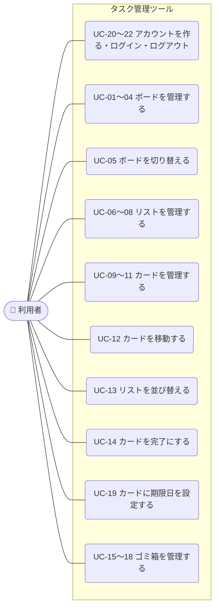

# 01-1 ユースケース：タスク管理ツール（Trello風）

> [要件定義書（本体）](01_requirements.md) の「3. 利用の流れ」の詳細です。
> 用語は [01-5 用語集](01-5_glossary.md) を参照してください。

**目次**
- [3.3 アクター](#33-アクターアプリを使う人)
- [3.4 ユースケース一覧](#34-ユースケース一覧)
- [3.5 ユースケース図](#35-ユースケース図)
- [3.6 ユースケース記述](#36-ユースケース記述)

---

### 3.3 アクター（アプリを使う人）
| アクター | 説明 |
|---|---|
| 利用者 | アカウントを作り、ログインしてボード・リスト・カードを操作する人 |

### 3.4 ユースケース一覧
対象はバージョン1で作る（優先度 Must の）機能です。機能は [01-2 機能要件](01-2_functional-requirements.md)、画面は [要件定義書 7. 画面一覧](01_requirements.md#7-画面一覧概要) を参照してください。

画面は S-01（メイン画面）、S-02（ログイン画面）、S-03（新規登録画面）の3つです。メイン画面の「表示エリア」は、ボードを表示している状態とゴミ箱を表示している状態を切り替えて使います。

| ID | ユースケース | アクター | 対応する機能 | 画面／表示エリアの状態 |
|---|---|---|---|---|
| [UC-20](#uc-20-アカウントを作る) | アカウントを作る | 利用者 | F-05 | S-03 新規登録 |
| [UC-21](#uc-21-ログインする) | ログインする | 利用者 | F-06, F-08 | S-02 ログイン |
| [UC-22](#uc-22-ログアウトする) | ログアウトする | 利用者 | F-07 | S-01 → S-02 |
| [UC-01](#uc-01-アプリを開く) | アプリを開く（ボード一覧を見る） | 利用者 | F-02, F-11 | ボード |
| [UC-02](#uc-02-ボードを作成する) | ボードを作成する | 利用者 | F-12 | ボード |
| [UC-03](#uc-03-ボード名を変更する) | ボード名を変更する | 利用者 | F-13 | ボード |
| [UC-04](#uc-04-ボードを削除するゴミ箱へ移動) | ボードを削除する（ゴミ箱へ移動） | 利用者 | F-14 | ボード |
| [UC-05](#uc-05-ボードを切り替える) | ボードを切り替える（リストとカードを見る） | 利用者 | F-15 | ボード |
| [UC-06](#uc-06-リストを作成する) | リストを作成する | 利用者 | F-21 | ボード |
| [UC-07](#uc-07-リスト名を変更する) | リスト名を変更する | 利用者 | F-22 | ボード |
| [UC-08](#uc-08-リストを削除するゴミ箱へ移動) | リストを削除する（ゴミ箱へ移動） | 利用者 | F-23 | ボード |
| [UC-09](#uc-09-カードを作成する) | カードを作成する | 利用者 | F-31 | ボード |
| [UC-10](#uc-10-カードを編集する) | カードを編集する | 利用者 | F-32 | ボード |
| [UC-11](#uc-11-カードを削除するゴミ箱へ移動) | カードを削除する（ゴミ箱へ移動） | 利用者 | F-33 | ボード |
| [UC-12](#uc-12-カードを移動する) | カードを移動する | 利用者 | F-34 | ボード |
| [UC-13](#uc-13-リストを並び替える) | リストを並び替える | 利用者 | F-24 | ボード |
| [UC-14](#uc-14-カードを完了にする) | カードを完了にする・未完了に戻す | 利用者 | F-38 | ボード |
| [UC-19](#uc-19-カードに期限日を設定する) | カードに期限日を設定する・変更する・削除する | 利用者 | F-35 | ボード |
| [UC-15](#uc-15-ゴミ箱を見る) | ゴミ箱を見る | 利用者 | F-41 | ゴミ箱 |
| [UC-16](#uc-16-ゴミ箱から元に戻す) | ゴミ箱から元に戻す | 利用者 | F-42 | ゴミ箱 |
| [UC-17](#uc-17-ゴミ箱から完全に削除する) | ゴミ箱から完全に削除する | 利用者 | F-43 | ゴミ箱 |
| [UC-18](#uc-18-ゴミ箱を空にする) | ゴミ箱を空にする | 利用者 | F-44 | ゴミ箱 |

> - F-01（自動保存）は、データを変更するすべてのユースケース（UC-02〜04、06〜14、16〜19）で動きます。
> - UC-01〜19 は、すべて「ログインしていること」が前提です。未ログインの状態で操作しようとしたときは、ログイン画面（S-02）に戻します（[01-3 業務ルール 5.6](01-3_business-rules.md#56-ログインのルール)）。
> - アカウント関連のユースケースは、あとから追加したため UC-20 番台にしています。UC-19（期限日）も、あとから追加したものです。

### 3.5 ユースケース図

> 図が見やすくなるように、似ているユースケース（作成・変更・削除など）は1つにまとめて描いています。

### 3.6 ユースケース記述

各ユースケースの流れを、次の形式で書きます。

- **事前条件**：始める前に満たしている必要があること
- **基本フロー**：うまくいくときの流れ
- **代替フロー**：エラーやキャンセルのときの流れ
- **事後条件**：終わったあとの状態

共通のルール：
- 入力ルール（[01-3 業務ルール 5.1](01-3_business-rules.md#51-入力のルール)）に合わないときは、保存せずに入力欄の近くにエラーメッセージを表示します。以下では「入力エラー」と書きます。
- データを変更したときは、サーバーへ自動で保存します。保存に失敗したときは「保存できませんでした」と表示します（[01-3 業務ルール 5.4](01-3_business-rules.md#54-保存のルール)）。以下では「保存エラー」と書きます。
- UC-01〜19 の途中でログインの期限が切れたときは、ログイン画面（S-02）に戻します（[01-3 業務ルール 5.6](01-3_business-rules.md#56-ログインのルール)）。
- 編集はすべて、押した場所でそのまま行います（[01-3 業務ルール 5.5](01-3_business-rules.md#55-編集のルール)）。
- ゴミ箱に入っているデータは、ボードの表示には出しません。

---

#### UC-20 アカウントを作る
| 項目 | 内容 |
|---|---|
| アクター | 利用者 |
| 事前条件 | ログインしていない |
| 基本フロー | 1. ログイン画面（S-02）で「新規登録」を押す 2. 新規登録画面（S-03）で、ユーザーID・パスワード・パスワード（確認用）を入力する 3. 「登録する」を押す 4. アカウントを作成し、パスワードはハッシュ化して保存する 5. そのままログインした状態にし、メイン画面（S-01）に「ボードがありません。新しく作成しましょう」と表示する |
| 代替フロー | 3a. 入力エラー（[5.1](01-3_business-rules.md#51-入力のルール)）→ 2 に戻る 3b. すでに使われているユーザーID → 「このユーザーID は使われています」と表示し、2 に戻る 3c. パスワードと確認用が一致しない → その旨を表示し、2 に戻る 4a. 通信エラー → 「登録できませんでした」と表示する |
| 事後条件 | アカウントが作成され、ログインした状態になっている |

#### UC-21 ログインする
| 項目 | 内容 |
|---|---|
| アクター | 利用者 |
| 事前条件 | アカウントを作成済みで、ログインしていない |
| 基本フロー | 1. アプリの URL を開く（またはログイン期限が切れた状態で操作する） 2. ログイン画面（S-02）を表示する 3. ユーザーID とパスワードを入力し、「ログイン」を押す 4. 入力内容を確認し、ログイン状態を30日間保持する Cookie を発行する 5. メイン画面（S-01）を表示する（UC-01 へ続く） |
| 代替フロー | 3a. 未入力 → 「ユーザーID とパスワードを入力してください」と表示する 4a. ユーザーID かパスワードが違う → 「ユーザーID またはパスワードが違います」と表示し、3 に戻る（どちらが違うかは知らせない） 4b. 通信エラー → 「ログインできませんでした」と表示する |
| 事後条件 | ログインした状態になっている |

#### UC-22 ログアウトする
| 項目 | 内容 |
|---|---|
| アクター | 利用者 |
| 事前条件 | ログインしている |
| 基本フロー | 1. サイドバーの「ログアウト」を押す 2. ログイン状態を破棄する（Cookie を消す） 3. ログイン画面（S-02）を表示する |
| 代替フロー | 1a. カードを編集中だった → 編集中のカードを確定してからログアウトする |
| 事後条件 | ログインしていない状態になっている。データはサーバーに残っている |

#### UC-01 アプリを開く
| 項目 | 内容 |
|---|---|
| アクター | 利用者 |
| 事前条件 | ログインしている |
| 基本フロー | 1. 利用者がアプリの URL を開く 2. サーバーから、ログイン中の利用者のデータを読み込む 3. メイン画面のサイドバーに、ボードを作成日が新しい順に表示し、ゴミ箱の件数を表示する 4. 前回最後に開いていたボードを選び、リストとカードを表示する |
| 代替フロー | 1a. ログインしていない（初回、ログアウト後、30日の期限切れ、サーバー再起動による解除） → ログイン画面（S-02）を表示する（UC-21 へ） 3a. ボードが1つもない（初めて開いたときなど） → 表示エリアに「ボードがありません。新しく作成しましょう」と表示する 4a. 前回開いていたボードがない（ゴミ箱に入っている場合も含む） → サイドバーの一番上のボードを表示する |
| 事後条件 | なし（データは変わらない） |

#### UC-02 ボードを作成する
| 項目 | 内容 |
|---|---|
| アクター | 利用者 |
| 事前条件 | メイン画面を開いている |
| 基本フロー | 1. サイドバーの「ボードを作成」を押す 2. ボード名を入力し、Enter キーを押す 3. ボードを作成して保存し、サイドバーの先頭に表示する 4. 作成したボードを選んだ状態にし、表示エリアに表示する |
| 代替フロー | 2a. 入力エラー → 2 に戻る 2b. Esc キーを押す → 作成せずに閉じる 3a. 保存エラー |
| 事後条件 | 新しいボードが作成・保存されている |

#### UC-03 ボード名を変更する
| 項目 | 内容 |
|---|---|
| アクター | 利用者 |
| 事前条件 | メイン画面でボードを表示している |
| 基本フロー | 1. 表示中のボード名（表示エリアの上部）を押す 2. ボード名がその場で入力欄に変わる 3. 新しいボード名を入力し、Enter キーを押す（または入力欄の外を押す） 4. ボード名を更新して保存し、サイドバーと表示エリアの両方に反映する |
| 代替フロー | 3a. 入力エラー → 3 に戻る 3b. Esc キーを押す → 変更せずに元の名前に戻す 4a. 保存エラー |
| 事後条件 | ボード名が変わっている |

#### UC-04 ボードを削除する（ゴミ箱へ移動）
| 項目 | 内容 |
|---|---|
| アクター | 利用者 |
| 事前条件 | メイン画面でボードを表示している |
| 基本フロー | 1. 表示中のボードの「削除」を押す 2. ボードを中のリスト・カードごとゴミ箱へ移動して保存し、サイドバーから消す（確認ダイアログは出さない） 3. サイドバーのゴミ箱の件数を1増やす 4. サイドバーの一番上のボードを表示する |
| 代替フロー | 2a. 保存エラー 4a. ボードが1つも残っていない → 「ボードがありません。新しく作成しましょう」と表示する |
| 事後条件 | ボードと中のリスト・カードがゴミ箱に入っている |

#### UC-05 ボードを切り替える
| 項目 | 内容 |
|---|---|
| アクター | 利用者 |
| 事前条件 | メイン画面を開いている。ボードがある |
| 基本フロー | 1. サイドバーのボード名を押す 2. 押したボードを選んだ状態（色を変えるなど）にする 3. 表示エリアに、リストを並び順どおりに左から並べ、各リストの中にカードを並び順どおりに表示する 4. 選んだボードを「最後に開いていたボード」として保存する |
| 代替フロー | 3a. リストが1つもない → 「リストを追加しましょう」と表示する |
| 事後条件 | 選んだボードが表示されている |

#### UC-06 リストを作成する
| 項目 | 内容 |
|---|---|
| アクター | 利用者 |
| 事前条件 | メイン画面でボードを表示している |
| 基本フロー | 1. 「リストを追加」を押す 2. その場に入力欄が出る。リスト名を入力し、Enter キーを押す（または「追加」を押す） 3. リストを作成して保存し、一番右に表示する 4. 続けて次のリストを入力できるよう、入力欄を開いたままにする |
| 代替フロー | 2a. 入力エラー → 2 に戻る 2b. Esc キーか「×」を押す → 作成せずに閉じる 3a. 保存エラー |
| 事後条件 | 新しいリストが作成されている |

#### UC-07 リスト名を変更する
| 項目 | 内容 |
|---|---|
| アクター | 利用者 |
| 事前条件 | メイン画面でボードを表示している。リストがある |
| 基本フロー | 1. リスト名を押す 2. リスト名がその場で入力欄に変わる 3. 新しいリスト名を入力し、Enter キーを押す（または入力欄の外を押す） 4. リスト名を更新して保存し、表示する |
| 代替フロー | 3a. 入力エラー → 3 に戻る 3b. Esc キーを押す → 変更せずに元の名前に戻す 4a. 保存エラー |
| 事後条件 | リスト名が変わっている |

#### UC-08 リストを削除する（ゴミ箱へ移動）
| 項目 | 内容 |
|---|---|
| アクター | 利用者 |
| 事前条件 | メイン画面でボードを表示している。リストがある |
| 基本フロー | 1. リストの「削除（🗑）」を押す 2. リストを中のカードごとゴミ箱へ移動して保存し、画面から消す（確認ダイアログは出さない） 3. サイドバーのゴミ箱の件数を1増やす |
| 代替フロー | 2a. 保存エラー |
| 事後条件 | リストと中のカードがゴミ箱に入っている |

#### UC-09 カードを作成する
| 項目 | 内容 |
|---|---|
| アクター | 利用者 |
| 事前条件 | メイン画面でボードを表示している。リストがある |
| 基本フロー | 1. リストの「カードを追加」を押す 2. その場に入力欄が出る。カードのタイトルを入力し、Enter キーを押す（または「追加」を押す） 3. カードを未完了・期限日なしの状態で作成して保存し、リストの一番下に表示する 4. 続けて次のカードを入力できるよう、入力欄を開いたままにする |
| 代替フロー | 2a. 入力エラー → 2 に戻る 2b. Esc キーか「×」を押す → 作成せずに閉じる 3a. 保存エラー |
| 事後条件 | 新しいカードが作成されている |

#### UC-10 カードを編集する
| 項目 | 内容 |
|---|---|
| アクター | 利用者 |
| 事前条件 | メイン画面でボードを表示している。カードがある |
| 基本フロー | 1. カードを押す（チェックボックス以外の場所） 2. カードがその場で広がり、タイトルと説明文の入力欄、期限日の入力欄（UC-19）、「保存」「キャンセル」「削除」ボタンを表示する 3. タイトルや説明文を書き換え、「保存」を押す（タイトル欄で Enter キーを押す、またはカードの外を押しても確定する） 4. 内容を更新して保存し、カードを元の表示に戻す |
| 代替フロー | 1a. 別のカードを編集中だった → 編集中のカードを確定してから、押したカードの編集を始める 3a. 入力エラー → 3 に戻る 3b. 「キャンセル」か Esc キーを押す → 変更せずに元の表示に戻す 4a. 保存エラー |
| 事後条件 | カードのタイトル・説明文が変わっている（変更した場合） |

#### UC-11 カードを削除する（ゴミ箱へ移動）
| 項目 | 内容 |
|---|---|
| アクター | 利用者 |
| 事前条件 | カードを編集中である（UC-10 の 2 の状態） |
| 基本フロー | 1. 「削除（🗑）」を押す 2. カードをゴミ箱へ移動して保存し、リストから消す（確認ダイアログは出さない） 3. サイドバーのゴミ箱の件数を1増やす |
| 代替フロー | 2a. 保存エラー |
| 事後条件 | カードがゴミ箱に入っている |

#### UC-12 カードを移動する
| 項目 | 内容 |
|---|---|
| アクター | 利用者 |
| 事前条件 | メイン画面でボードを表示している。カードがある |
| 基本フロー | 1. カードをマウスでつかむ 2. 移動したい場所（同じリストの別の位置、または別のリスト）へドラッグする。移動先には、落ちる位置の目印を表示する 3. マウスを離す 4. カードを離した位置に表示し、所属リストと並び順を保存する |
| 代替フロー | 3a. リストの外で離した → 元の位置に戻す 4a. 保存に失敗した → 「移動を保存できませんでした」と表示し、カードを元の位置に戻す |
| 事後条件 | カードの所属リストと並び順が変わっている。再読み込みしても移動後の位置のまま |

#### UC-13 リストを並び替える
| 項目 | 内容 |
|---|---|
| アクター | 利用者 |
| 事前条件 | メイン画面でボードを表示している。リストが2つ以上ある |
| 基本フロー | 1. リストの見出し部分（リスト名とボタン以外）をマウスでつかむ 2. 移動したい位置（左右）へドラッグする。移動先には、落ちる位置の目印を表示する 3. マウスを離す 4. リストを離した位置に表示し、並び順を保存する |
| 代替フロー | 3a. 表示エリアの外で離した → 元の位置に戻す 4a. 保存に失敗した → 「並び替えを保存できませんでした」と表示し、リストを元の位置に戻す |
| 事後条件 | リストの並び順が変わっている。再読み込みしても並び替えた順のまま |

#### UC-14 カードを完了にする
| 項目 | 内容 |
|---|---|
| アクター | 利用者 |
| 事前条件 | メイン画面でボードを表示している。カードがある |
| 基本フロー | 1. カードの左にあるチェックボックスを押す 2. カードを完了にして保存する 3. チェックを付け、タイトルに取り消し線を引き、カードを薄い色で表示する（カードの位置は変えない） |
| 代替フロー | 1a. チェック済みのチェックボックスを押す → 未完了に戻して保存し、通常の表示に戻す 2a. 保存エラー → チェックを元の状態に戻す |
| 事後条件 | カードの完了・未完了が切り替わっている |

#### UC-19 カードに期限日を設定する
| 項目 | 内容 |
|---|---|
| アクター | 利用者 |
| 事前条件 | カードを編集中である（UC-10 の 2 の状態） |
| 基本フロー | 1. 期限日の入力欄（日付）を押す 2. 日付を選ぶ（または入力する） 3. 「保存」を押す（またはカードの外を押す） 4. 期限日を保存し、カードに期限日を表示する。期限日を過ぎた未完了のカードは、日付を色で目立たせる |
| 代替フロー | 2a. 入力エラー（[5.1](01-3_business-rules.md#51-入力のルール)）→ 2 に戻る 2b. 「期限日を消す」を押す → 期限日を空にして保存し、カードから期限日の表示を消す 3a. 「キャンセル」か Esc キーを押す → 変更せずに元の表示に戻す 4a. 保存エラー |
| 事後条件 | カードの期限日が設定・変更・削除されている |

#### UC-15 ゴミ箱を見る
| 項目 | 内容 |
|---|---|
| アクター | 利用者 |
| 事前条件 | メイン画面を開いている |
| 基本フロー | 1. サイドバーの「ゴミ箱」を押す 2. 表示エリアをゴミ箱の表示に切り替える 3. ゴミ箱のデータを削除日時が新しい順に並べ、それぞれの種類（ボード・リスト・カード）、名前、元の場所、削除日時、中に含まれる件数を表示する |
| 代替フロー | 1a. カードを編集中だった → 編集中のカードを確定してから切り替える 3a. ゴミ箱が空 → 「ゴミ箱は空です」と表示し、「ゴミ箱を空にする」ボタンを押せない状態にする |
| 事後条件 | なし（データは変わらない） |

#### UC-16 ゴミ箱から元に戻す
| 項目 | 内容 |
|---|---|
| アクター | 利用者 |
| 事前条件 | ゴミ箱を表示している。ゴミ箱にデータがある |
| 基本フロー | 1. 戻したいデータの「元に戻す」を押す 2. データを（中のデータごと）元の場所に戻して保存する（リストは一番右、カードは一番下に入る） 3. ゴミ箱の一覧から消し、サイドバーの件数を1減らす |
| 代替フロー | 2a. 戻す場所がない → [01-3 業務ルール 5.3「元に戻すときのルール」](01-3_business-rules.md#元に戻すときのルール) に従う 2b. 保存エラー |
| 事後条件 | データが元の場所に戻っている |

#### UC-17 ゴミ箱から完全に削除する
| 項目 | 内容 |
|---|---|
| アクター | 利用者 |
| 事前条件 | ゴミ箱を表示している。ゴミ箱にデータがある |
| 基本フロー | 1. 削除したいデータの「完全に削除」を押す 2. 「『（名前）』を完全に削除します。元に戻せません。削除しますか？」という確認ダイアログを表示する（リスト・ボードの場合は、中のデータも削除されることも書く） 3. 「完全に削除する」を押す 4. データと中のデータを完全に削除して保存し、ゴミ箱の一覧から消す |
| 代替フロー | 3a. 「キャンセル」か Esc キーを押す → 何もせずダイアログを閉じる 4a. 保存エラー |
| 事後条件 | データが完全に削除され、元に戻せない |

#### UC-18 ゴミ箱を空にする
| 項目 | 内容 |
|---|---|
| アクター | 利用者 |
| 事前条件 | ゴミ箱を表示している。ゴミ箱にデータがある |
| 基本フロー | 1. 「ゴミ箱を空にする」を押す 2. 「ゴミ箱の（件数）件をすべて完全に削除します。元に戻せません。削除しますか？」という確認ダイアログを表示する 3. 「完全に削除する」を押す 4. ゴミ箱のデータをすべて完全に削除して保存し、「ゴミ箱は空です」と表示する |
| 代替フロー | 3a. 「キャンセル」か Esc キーを押す → 何もせずダイアログを閉じる 4a. 保存エラー |
| 事後条件 | ゴミ箱が空になっている |

---

[↑ 要件定義書（本体）に戻る](01_requirements.md)
