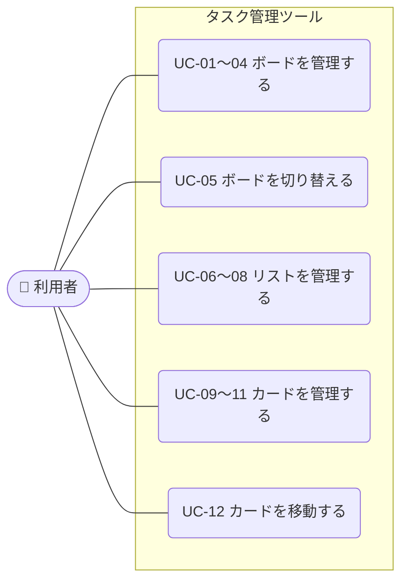

# 01-1 ユースケース：タスク管理ツール（Trello風）

> [要件定義書（本体）](01_要件定義書.md) の「3. 利用の流れ」の詳細です。
> 用語は [01-5 用語集](01-5_用語集.md) を参照してください。

**目次**
- [3.3 アクター](#33-アクターアプリを使う人)
- [3.4 ユースケース一覧](#34-ユースケース一覧)
- [3.5 ユースケース図](#35-ユースケース図)
- [3.6 ユースケース記述](#36-ユースケース記述)

---

### 3.3 アクター（アプリを使う人）
| アクター | 説明 |
|---|---|
| 利用者 | ブラウザでアプリを開いた人。ログインせずに、ボード・リスト・カードを操作できる |

### 3.4 ユースケース一覧
対象はバージョン1で作る（優先度 Must の）機能です。機能は [01-2 機能要件](01-2_機能要件.md)、画面は [要件定義書 7. 画面一覧](01_要件定義書.md#7-画面一覧概要) を参照してください。

| ID | ユースケース | アクター | 対応する機能 | 画面 |
|---|---|---|---|---|
| [UC-01](#uc-01-アプリを開く) | アプリを開く（ボード一覧を見る） | 利用者 | F-02, F-11 | S-01 |
| [UC-02](#uc-02-ボードを作成する) | ボードを作成する | 利用者 | F-12 | S-01 |
| [UC-03](#uc-03-ボード名を変更する) | ボード名を変更する | 利用者 | F-13 | S-01 |
| [UC-04](#uc-04-ボードを削除する) | ボードを削除する | 利用者 | F-14 | S-01 |
| [UC-05](#uc-05-ボードを切り替える) | ボードを切り替える（リストとカードを見る） | 利用者 | F-15 | S-01 |
| [UC-06](#uc-06-リストを作成する) | リストを作成する | 利用者 | F-21 | S-01 |
| [UC-07](#uc-07-リスト名を変更する) | リスト名を変更する | 利用者 | F-22 | S-01 |
| [UC-08](#uc-08-リストを削除する) | リストを削除する | 利用者 | F-23 | S-01 |
| [UC-09](#uc-09-カードを作成する) | カードを作成する | 利用者 | F-31 | S-01 |
| [UC-10](#uc-10-カードの詳細を見る編集する) | カードの詳細を見る・編集する | 利用者 | F-32 | S-02 |
| [UC-11](#uc-11-カードを削除する) | カードを削除する | 利用者 | F-33 | S-02 |
| [UC-12](#uc-12-カードを移動する) | カードを移動する | 利用者 | F-34 | S-01 |

> F-01（自動保存）は、データを変更するすべてのユースケース（UC-02〜04、06〜12）で動きます。

### 3.5 ユースケース図

> 図が見やすくなるように、似ているユースケース（作成・変更・削除など）は1つにまとめて描いています。

### 3.6 ユースケース記述

各ユースケースの流れを、次の形式で書きます。

- **事前条件**：始める前に満たしている必要があること
- **基本フロー**：うまくいくときの流れ
- **代替フロー**：エラーやキャンセルのときの流れ
- **事後条件**：終わったあとの状態

共通のルール：
- 入力ルール（[01-3 業務ルール 5.1](01-3_業務ルール.md#51-入力のルール)）に合わないときは、保存せずに入力欄の近くにエラーメッセージを表示します。以下では「入力エラー」と書きます。
- データを変更したときは、ブラウザに自動で保存します。保存に失敗したときは「保存できませんでした」と表示します（[01-3 業務ルール 5.4](01-3_業務ルール.md#54-保存のルール)）。以下では「保存エラー」と書きます。

---

#### UC-01 アプリを開く
| 項目 | 内容 |
|---|---|
| アクター | 利用者 |
| 事前条件 | なし |
| 基本フロー | 1. 利用者がアプリの URL を開く 2. ブラウザに保存したデータを読み込む 3. メイン画面のサイドバーに、ボードを作成日が新しい順に表示する 4. 前回最後に開いていたボードを選び、リストとカードを表示する |
| 代替フロー | 3a. ボードが1つもない（初めて開いたときなど） → ボードの表示エリアに「ボードがありません。新しく作成しましょう」と表示する 4a. 前回開いていたボードがない → サイドバーの一番上のボードを表示する |
| 事後条件 | なし（データは変わらない） |

#### UC-02 ボードを作成する
| 項目 | 内容 |
|---|---|
| アクター | 利用者 |
| 事前条件 | メイン画面を開いている |
| 基本フロー | 1. サイドバーの「ボードを作成」を押す 2. ボード名を入力し、「作成」を押す 3. ボードを作成して保存し、サイドバーの先頭に表示する 4. 作成したボードを選んだ状態にし、表示エリアに表示する |
| 代替フロー | 2a. 入力エラー → 2 に戻る 2b. 「キャンセル」を押す → 作成せずに閉じる 3a. 保存エラー |
| 事後条件 | 新しいボードが作成・保存されている |

#### UC-03 ボード名を変更する
| 項目 | 内容 |
|---|---|
| アクター | 利用者 |
| 事前条件 | メイン画面を開いている。ボードがある |
| 基本フロー | 1. 表示中のボード名（表示エリアの上部）を押す 2. 新しいボード名を入力し、Enter キーを押す（または入力欄の外を押す） 3. ボード名を更新して保存し、サイドバーと表示エリアの両方に反映する |
| 代替フロー | 2a. 入力エラー → 2 に戻る 2b. Esc キーを押す → 変更せずに元の名前に戻す 3a. 保存エラー |
| 事後条件 | ボード名が変わっている |

#### UC-04 ボードを削除する
| 項目 | 内容 |
|---|---|
| アクター | 利用者 |
| 事前条件 | メイン画面を開いている。ボードがある |
| 基本フロー | 1. 表示中のボードの「削除」を押す 2. 「ボード内のリストとカードもすべて削除され、元に戻せません。削除しますか？」という確認ダイアログを表示する 3. 「削除する」を押す 4. ボードと中のリスト・カードを削除して保存し、サイドバーから消す 5. サイドバーの一番上のボードを表示する |
| 代替フロー | 3a. 「キャンセル」を押す → 何もせずダイアログを閉じる 4a. 保存エラー 5a. ボードが1つも残っていない → 「ボードがありません。新しく作成しましょう」と表示する |
| 事後条件 | ボードと中のリスト・カードが削除されている |

#### UC-05 ボードを切り替える
| 項目 | 内容 |
|---|---|
| アクター | 利用者 |
| 事前条件 | メイン画面を開いている。ボードがある |
| 基本フロー | 1. サイドバーのボード名を押す 2. 押したボードを選んだ状態（色を変えるなど）にする 3. 表示エリアに、リストを作成した順に左から並べ、各リストの中にカードを並び順どおりに表示する 4. 選んだボードを「最後に開いていたボード」として保存する |
| 代替フロー | 3a. リストが1つもない → 「リストを追加しましょう」と表示する |
| 事後条件 | 選んだボードが表示されている |

#### UC-06 リストを作成する
| 項目 | 内容 |
|---|---|
| アクター | 利用者 |
| 事前条件 | メイン画面でボードを表示している |
| 基本フロー | 1. 「リストを追加」を押す 2. リスト名を入力し、「追加」を押す 3. リストを作成して保存し、一番右に表示する |
| 代替フロー | 2a. 入力エラー → 2 に戻る 2b. 「キャンセル」を押す → 作成せずに閉じる 3a. 保存エラー |
| 事後条件 | 新しいリストが作成されている |

#### UC-07 リスト名を変更する
| 項目 | 内容 |
|---|---|
| アクター | 利用者 |
| 事前条件 | メイン画面でボードを表示している。リストがある |
| 基本フロー | 1. リスト名を押す 2. 新しいリスト名を入力し、Enter キーを押す（または入力欄の外を押す） 3. リスト名を更新して保存し、表示する |
| 代替フロー | 2a. 入力エラー → 2 に戻る 2b. Esc キーを押す → 変更せずに元の名前に戻す 3a. 保存エラー |
| 事後条件 | リスト名が変わっている |

#### UC-08 リストを削除する
| 項目 | 内容 |
|---|---|
| アクター | 利用者 |
| 事前条件 | メイン画面でボードを表示している。リストがある |
| 基本フロー | 1. リストの「削除」を押す 2. 「リスト内のカードもすべて削除され、元に戻せません。削除しますか？」という確認ダイアログを表示する 3. 「削除する」を押す 4. リストと中のカードを削除して保存し、画面から消す |
| 代替フロー | 3a. 「キャンセル」を押す → 何もせずダイアログを閉じる 4a. 保存エラー |
| 事後条件 | リストと中のカードが削除されている |

#### UC-09 カードを作成する
| 項目 | 内容 |
|---|---|
| アクター | 利用者 |
| 事前条件 | メイン画面でボードを表示している。リストがある |
| 基本フロー | 1. リストの「カードを追加」を押す 2. カードのタイトルを入力し、「追加」を押す 3. カードを作成して保存し、リストの一番下に表示する |
| 代替フロー | 2a. 入力エラー → 2 に戻る 2b. 「キャンセル」を押す → 作成せずに閉じる 3a. 保存エラー |
| 事後条件 | 新しいカードが作成されている |

#### UC-10 カードの詳細を見る・編集する
| 項目 | 内容 |
|---|---|
| アクター | 利用者 |
| 事前条件 | メイン画面でボードを表示している。カードがある |
| 基本フロー | 1. カードを押す 2. カード詳細（モーダル）にタイトルと説明文を表示する 3. タイトルや説明文を書き換え、「保存」を押す 4. 内容を更新して保存し、メイン画面のカードの表示にも反映する |
| 代替フロー | 3a. 入力エラー → 3 に戻る 3b. 何も変更せずにモーダルを閉じる → データは変わらない 4a. 保存エラー |
| 事後条件 | カードのタイトル・説明文が変わっている（変更した場合） |

#### UC-11 カードを削除する
| 項目 | 内容 |
|---|---|
| アクター | 利用者 |
| 事前条件 | カード詳細（モーダル）を開いている |
| 基本フロー | 1. 「削除」を押す 2. 「カードを削除します。元に戻せません。削除しますか？」という確認ダイアログを表示する 3. 「削除する」を押す 4. カードを削除して保存し、モーダルを閉じて、リストから消す |
| 代替フロー | 3a. 「キャンセル」を押す → 何もせずダイアログを閉じる 4a. 保存エラー |
| 事後条件 | カードが削除されている |

#### UC-12 カードを移動する
| 項目 | 内容 |
|---|---|
| アクター | 利用者 |
| 事前条件 | メイン画面でボードを表示している。カードがある |
| 基本フロー | 1. カードをマウスでつかむ 2. 移動したい場所（同じリストの別の位置、または別のリスト）へドラッグする 3. マウスを離す 4. カードを離した位置に表示し、所属リストと並び順を保存する |
| 代替フロー | 3a. リストの外で離した → 元の位置に戻す 4a. 保存に失敗した → 「移動を保存できませんでした」と表示し、カードを元の位置に戻す |
| 事後条件 | カードの所属リストと並び順が変わっている。再読み込みしても移動後の位置のまま |

---

[↑ 要件定義書（本体）に戻る](01_要件定義書.md)
