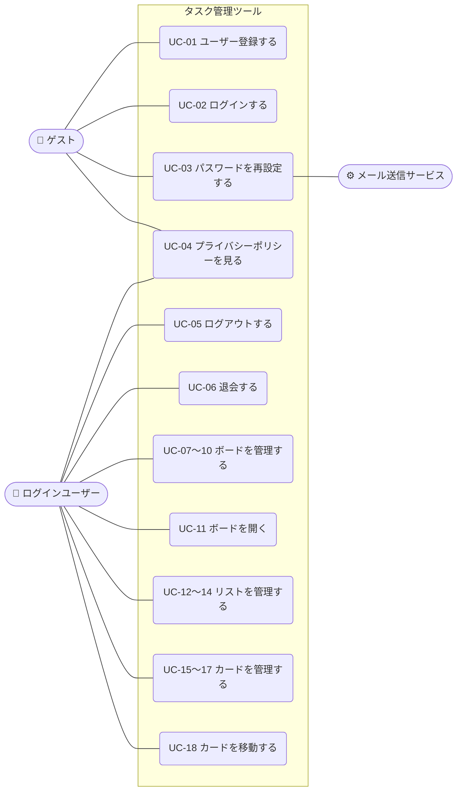

# 01-1 ユースケース：タスク管理ツール（Trello風）

> [要件定義書（本体）](01_要件定義書.md) の「3. 利用の流れ」の詳細です。
> 用語は [01-5 用語集](01-5_用語集.md) を参照してください。

**目次**
- [3.3 アクター](#33-アクターアプリを使う人仕組み)
- [3.4 ユースケース一覧](#34-ユースケース一覧)
- [3.5 ユースケース図](#35-ユースケース図)
- [3.6 ユースケース記述](#36-ユースケース記述)

---

### 3.3 アクター（アプリを使う人・仕組み）
| アクター | 説明 |
|---|---|
| ゲスト | ログインしていない人。登録・ログイン・パスワード再設定だけができる |
| ログインユーザー | ログインしている人。自分のボード・リスト・カードを操作できる |
| メール送信サービス | パスワード再設定用のメールを送る外部の仕組み |

### 3.4 ユースケース一覧
対象はバージョン1で作る（優先度 Must の）機能です。機能は [01-2 機能要件](01-2_機能要件.md)、画面は [要件定義書 7. 画面一覧](01_要件定義書.md#7-画面一覧概要) を参照してください。

| ID | ユースケース | アクター | 対応する機能 | 画面 |
|---|---|---|---|---|
| [UC-01](#uc-01-ユーザー登録する) | ユーザー登録する | ゲスト | F-01 | S-02 |
| [UC-02](#uc-02-ログインする) | ログインする | ゲスト | F-02 | S-01 |
| [UC-03](#uc-03-パスワードを再設定する) | パスワードを再設定する | ゲスト、メール送信サービス | F-04 | S-03, S-04 |
| [UC-04](#uc-04-プライバシーポリシーを見る) | プライバシーポリシーを見る | ゲスト、ログインユーザー | ― | S-09 |
| [UC-05](#uc-05-ログアウトする) | ログアウトする | ログインユーザー | F-02 | S-08 |
| [UC-06](#uc-06-退会する) | 退会する | ログインユーザー | F-05 | S-08 |
| [UC-07](#uc-07-ボード一覧を見る) | ボード一覧を見る | ログインユーザー | F-11 | S-05 |
| [UC-08](#uc-08-ボードを作成する) | ボードを作成する | ログインユーザー | F-12 | S-05 |
| [UC-09](#uc-09-ボード名を変更する) | ボード名を変更する | ログインユーザー | F-13 | S-05 |
| [UC-10](#uc-10-ボードを削除する) | ボードを削除する | ログインユーザー | F-14 | S-05 |
| [UC-11](#uc-11-ボードを開く) | ボードを開く（リストとカードを見る） | ログインユーザー | F-03 | S-06 |
| [UC-12](#uc-12-リストを作成する) | リストを作成する | ログインユーザー | F-21 | S-06 |
| [UC-13](#uc-13-リスト名を変更する) | リスト名を変更する | ログインユーザー | F-22 | S-06 |
| [UC-14](#uc-14-リストを削除する) | リストを削除する | ログインユーザー | F-23 | S-06 |
| [UC-15](#uc-15-カードを作成する) | カードを作成する | ログインユーザー | F-31 | S-06 |
| [UC-16](#uc-16-カードの詳細を見る編集する) | カードの詳細を見る・編集する | ログインユーザー | F-32 | S-07 |
| [UC-17](#uc-17-カードを削除する) | カードを削除する | ログインユーザー | F-33 | S-07 |
| [UC-18](#uc-18-カードを移動する) | カードを移動する | ログインユーザー | F-34 | S-06 |

### 3.5 ユースケース図

> 図が見やすくなるように、似ているユースケース（作成・変更・削除など）は1つにまとめて描いています。

### 3.6 ユースケース記述

各ユースケースの流れを、次の形式で書きます。

- **事前条件**：始める前に満たしている必要があること
- **基本フロー**：うまくいくときの流れ
- **代替フロー**：エラーやキャンセルのときの流れ
- **事後条件**：終わったあとの状態

共通のルール：
- ログインユーザーのユースケース（UC-05〜18）は、「ログインしていること」を事前条件とします。ログインしていない状態で画面を開いたときは、ログイン画面を表示します。
- 入力ルール（[01-3 業務ルール 5.1](01-3_業務ルール.md#51-入力のルール)）に合わないときは、保存せずに入力欄の近くにエラーメッセージを表示します。以下では「入力エラー」と書きます。

---

#### UC-01 ユーザー登録する
| 項目 | 内容 |
|---|---|
| アクター | ゲスト |
| 事前条件 | ログインしていない |
| 基本フロー | 1. ゲストがユーザー登録画面を開く 2. メールアドレスとパスワードを入力し、「登録」を押す 3. アプリがアカウントを作成する 4. ログインした状態でボード一覧画面を表示する |
| 代替フロー | 2a. 入力エラー → 2 に戻る 3a. すでに登録されているメールアドレス → 「このメールアドレスは登録済みです」と表示し、2 に戻る |
| 事後条件 | アカウントが作成され、ログインしている |

#### UC-02 ログインする
| 項目 | 内容 |
|---|---|
| アクター | ゲスト |
| 事前条件 | アカウントを持っている |
| 基本フロー | 1. ゲストがログイン画面を開く 2. メールアドレスとパスワードを入力し、「ログイン」を押す 3. アプリが入力内容を確認する 4. ボード一覧画面を表示する |
| 代替フロー | 3a. メールアドレスかパスワードが違う → 「メールアドレスまたはパスワードが正しくありません」と表示し、2 に戻る（どちらが違うかは表示しない） |
| 事後条件 | ログインしている |

#### UC-03 パスワードを再設定する
| 項目 | 内容 |
|---|---|
| アクター | ゲスト、メール送信サービス |
| 事前条件 | アカウントを持っている |
| 基本フロー | 1. ゲストがログイン画面の「パスワードを忘れた方」を押す 2. パスワード再設定申請画面でメールアドレスを入力し、「送信」を押す 3. メール送信サービスが、再設定用のリンクをメールで送る 4. ゲストがメールのリンクを開く 5. パスワード再設定画面で新しいパスワードを入力し、「変更」を押す 6. パスワードを更新し、ログイン画面を表示する |
| 代替フロー | 2a. 登録されていないメールアドレス → 3 と同じ「メールを送信しました」という表示にする（登録されているかどうかを他人に知られないため）。メールは送らない 4a. リンクの有効期限が切れている → 「リンクの有効期限が切れています」と表示し、2 からやり直してもらう 5a. 入力エラー → 5 に戻る |
| 事後条件 | パスワードが新しいものに変わっている |

#### UC-04 プライバシーポリシーを見る
| 項目 | 内容 |
|---|---|
| アクター | ゲスト、ログインユーザー |
| 事前条件 | なし |
| 基本フロー | 1. ユーザー登録画面などのリンクを押す 2. プライバシーポリシー画面を表示する |
| 代替フロー | なし |
| 事後条件 | なし（データは変わらない） |

#### UC-05 ログアウトする
| 項目 | 内容 |
|---|---|
| アクター | ログインユーザー |
| 事前条件 | ログインしている |
| 基本フロー | 1. アカウント設定画面で「ログアウト」を押す 2. ログアウトし、ログイン画面を表示する |
| 代替フロー | なし |
| 事後条件 | ログインしていない状態になる |

#### UC-06 退会する
| 項目 | 内容 |
|---|---|
| アクター | ログインユーザー |
| 事前条件 | ログインしている |
| 基本フロー | 1. アカウント設定画面で「退会する」を押す 2. 「すべてのデータが削除され、元に戻せません。退会しますか？」という確認ダイアログを表示する 3. 「退会する」を押す 4. アカウントとすべてのボード・リスト・カードを削除する 5. ログイン画面を表示する |
| 代替フロー | 3a. 「キャンセル」を押す → 何もせずダイアログを閉じる |
| 事後条件 | アカウントとすべてのデータが削除されている |

#### UC-07 ボード一覧を見る
| 項目 | 内容 |
|---|---|
| アクター | ログインユーザー |
| 事前条件 | ログインしている |
| 基本フロー | 1. ボード一覧画面を開く 2. 自分のボードを作成日が新しい順に表示する |
| 代替フロー | 2a. ボードが1つもない → 「ボードがありません。新しく作成しましょう」と表示する |
| 事後条件 | なし（データは変わらない） |

#### UC-08 ボードを作成する
| 項目 | 内容 |
|---|---|
| アクター | ログインユーザー |
| 事前条件 | ログインしている |
| 基本フロー | 1. ボード一覧画面で「ボードを作成」を押す 2. ボード名を入力し、「作成」を押す 3. ボードを作成し、一覧の先頭に表示する |
| 代替フロー | 2a. 入力エラー → 2 に戻る 2b. 「キャンセル」を押す → 作成せずに閉じる |
| 事後条件 | 新しいボードが作成されている |

#### UC-09 ボード名を変更する
| 項目 | 内容 |
|---|---|
| アクター | ログインユーザー |
| 事前条件 | ログインしている。自分のボードがある |
| 基本フロー | 1. ボードの「名前を変更」を押す 2. 新しいボード名を入力し、「保存」を押す 3. ボード名を更新して表示する |
| 代替フロー | 2a. 入力エラー → 2 に戻る 2b. 「キャンセル」を押す → 変更せずに閉じる |
| 事後条件 | ボード名が変わっている |

#### UC-10 ボードを削除する
| 項目 | 内容 |
|---|---|
| アクター | ログインユーザー |
| 事前条件 | ログインしている。自分のボードがある |
| 基本フロー | 1. ボードの「削除」を押す 2. 「ボード内のリストとカードもすべて削除され、元に戻せません。削除しますか？」という確認ダイアログを表示する 3. 「削除する」を押す 4. ボードと中のリスト・カードを削除し、一覧から消す |
| 代替フロー | 3a. 「キャンセル」を押す → 何もせずダイアログを閉じる |
| 事後条件 | ボードと中のリスト・カードが削除されている |

#### UC-11 ボードを開く
| 項目 | 内容 |
|---|---|
| アクター | ログインユーザー |
| 事前条件 | ログインしている。自分のボードがある |
| 基本フロー | 1. ボード一覧画面でボードを押す 2. ボード詳細画面に、リストを作成した順に左から並べ、各リストの中にカードを並び順どおりに表示する |
| 代替フロー | 1a. 他のユーザーのボードや存在しないボードの URL を直接開いた → 「ボードが見つかりません」と表示し、ボード一覧画面へ戻るリンクを出す 2a. リストが1つもない → 「リストを追加しましょう」と表示する |
| 事後条件 | なし（データは変わらない） |

#### UC-12 リストを作成する
| 項目 | 内容 |
|---|---|
| アクター | ログインユーザー |
| 事前条件 | ボード詳細画面を開いている |
| 基本フロー | 1. 「リストを追加」を押す 2. リスト名を入力し、「追加」を押す 3. リストを作成し、一番右に表示する |
| 代替フロー | 2a. 入力エラー → 2 に戻る 2b. 「キャンセル」を押す → 作成せずに閉じる |
| 事後条件 | 新しいリストが作成されている |

#### UC-13 リスト名を変更する
| 項目 | 内容 |
|---|---|
| アクター | ログインユーザー |
| 事前条件 | ボード詳細画面を開いている。リストがある |
| 基本フロー | 1. リスト名を押す 2. 新しいリスト名を入力し、Enter キーを押す（または入力欄の外を押す） 3. リスト名を更新して表示する |
| 代替フロー | 2a. 入力エラー → 2 に戻る 2b. Esc キーを押す → 変更せずに元の名前に戻す |
| 事後条件 | リスト名が変わっている |

#### UC-14 リストを削除する
| 項目 | 内容 |
|---|---|
| アクター | ログインユーザー |
| 事前条件 | ボード詳細画面を開いている。リストがある |
| 基本フロー | 1. リストの「削除」を押す 2. 「リスト内のカードもすべて削除され、元に戻せません。削除しますか？」という確認ダイアログを表示する 3. 「削除する」を押す 4. リストと中のカードを削除し、画面から消す |
| 代替フロー | 3a. 「キャンセル」を押す → 何もせずダイアログを閉じる |
| 事後条件 | リストと中のカードが削除されている |

#### UC-15 カードを作成する
| 項目 | 内容 |
|---|---|
| アクター | ログインユーザー |
| 事前条件 | ボード詳細画面を開いている。リストがある |
| 基本フロー | 1. リストの「カードを追加」を押す 2. カードのタイトルを入力し、「追加」を押す 3. カードを作成し、リストの一番下に表示する |
| 代替フロー | 2a. 入力エラー → 2 に戻る 2b. 「キャンセル」を押す → 作成せずに閉じる |
| 事後条件 | 新しいカードが作成されている |

#### UC-16 カードの詳細を見る・編集する
| 項目 | 内容 |
|---|---|
| アクター | ログインユーザー |
| 事前条件 | ボード詳細画面を開いている。カードがある |
| 基本フロー | 1. カードを押す 2. カード詳細（モーダル）にタイトルと説明文を表示する 3. タイトルや説明文を書き換え、「保存」を押す 4. 内容を更新し、ボード詳細画面の表示にも反映する |
| 代替フロー | 3a. 入力エラー → 3 に戻る 3b. 何も変更せずにモーダルを閉じる → データは変わらない |
| 事後条件 | カードのタイトル・説明文が変わっている（変更した場合） |

#### UC-17 カードを削除する
| 項目 | 内容 |
|---|---|
| アクター | ログインユーザー |
| 事前条件 | カード詳細（モーダル）を開いている |
| 基本フロー | 1. 「削除」を押す 2. 「カードを削除します。元に戻せません。削除しますか？」という確認ダイアログを表示する 3. 「削除する」を押す 4. カードを削除し、モーダルを閉じて、リストから消す |
| 代替フロー | 3a. 「キャンセル」を押す → 何もせずダイアログを閉じる |
| 事後条件 | カードが削除されている |

#### UC-18 カードを移動する
| 項目 | 内容 |
|---|---|
| アクター | ログインユーザー |
| 事前条件 | ボード詳細画面を開いている。カードがある |
| 基本フロー | 1. カードをマウスでつかむ 2. 移動したい場所（同じリストの別の位置、または別のリスト）へドラッグする 3. マウスを離す 4. カードを離した位置に表示し、所属リストと並び順を保存する |
| 代替フロー | 3a. リストの外で離した → 元の位置に戻す 4a. 保存に失敗した → 「移動を保存できませんでした」と表示し、カードを元の位置に戻す |
| 事後条件 | カードの所属リストと並び順が変わっている。再読み込みしても移動後の位置のまま |

---

[↑ 要件定義書（本体）に戻る](01_要件定義書.md)
