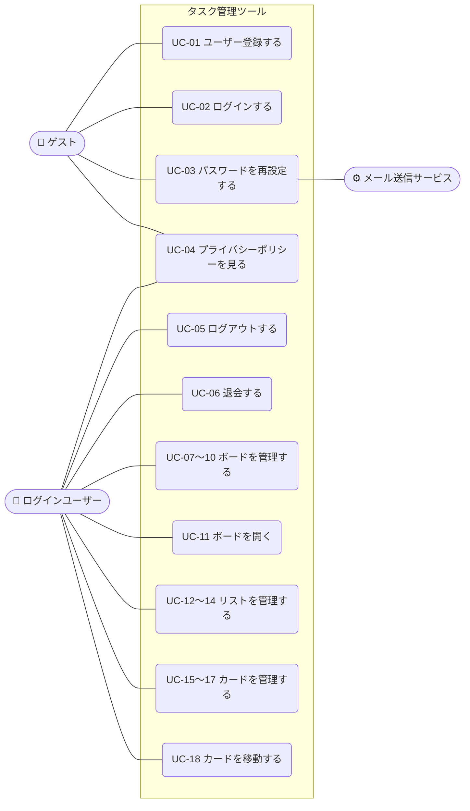
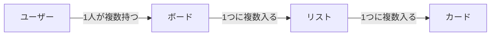

# 要件定義書：タスク管理ツール（Trello風）

| 項目 | 内容 |
|---|---|
| ドキュメント版数 | 0.5（ドラフト） |
| 作成日 | 2026-09-17 |
| 作成者 | （氏名） |
| ステータス | レビュー待ち |

> 本書は学習用の課題として、「お客様に説明し、合意をいただくための資料」という想定で作成しています。
> 専門用語は、巻末の「付録A 用語集」で説明しています。

---

## 1. プロジェクト概要

### 1.1 背景
個人や小規模チームでは、やることが頭の中やメモに散らばり、進み具合が見えにくくなりがちです。

### 1.2 目的
「ボード・リスト・カード」の形でタスクを見える化し、ドラッグ＆ドロップで簡単に進み具合を管理できる Web アプリを作ります。

### 1.3 対象ユーザー
- タスクを整理したい個人ユーザー（学生・社会人）

---

## 2. スコープ

### 2.1 対象範囲（今回作るもの）
- ユーザー登録・ログイン・パスワード再設定・退会
- ボード・リスト・カードの作成、表示、編集、削除
- ドラッグ＆ドロップでのカード移動
- プライバシーポリシーの掲載

### 2.2 対象外（今回は作らないもの）
- 複数ユーザーでのボード共有・リアルタイム同時編集
- ファイル添付
- 期限の通知メール
- スマホ用アプリ、スマホ・タブレットのブラウザでの表示
- 運用・保守（データのバックアップ、障害対応、問い合わせ対応）※学習用の課題のため

### 2.3 開発方針
- まずは **Must の機能だけ** を作り、インターネットに公開する（バージョン1）
- Should／Could の機能は、公開したあとに必要に応じて追加する

---

## 3. 利用の流れ（利用シナリオ）

### 3.1 基本の使い方
```
①ユーザー登録 → ②ログイン → ③ボードを作る（例：「課題制作」）
→ ④リストを作る（例：「未着手」「作業中」「完了」）
→ ⑤やることをカードとして「未着手」に追加する
→ ⑥作業を始めたら、カードを「作業中」へドラッグ＆ドロップで移動する
→ ⑦終わったら「完了」へ移動する
```

### 3.2 利用シナリオの例
| No | 場面 | ユーザーの操作 | アプリの動き |
|---|---|---|---|
| 1 | 初めて使う | メールアドレスとパスワードを入力して登録する | 登録してボード一覧画面を表示する |
| 2 | 課題を整理したい | 「課題制作」ボードを作り、リストを3つ作る | ボード詳細画面にリストが横に並ぶ |
| 3 | やることを書き出す | 「未着手」にカードを追加する | カードがリストの一番下に追加される |
| 4 | 作業が進んだ | カードを「作業中」へドラッグする | カードが移動し、再読み込みしても移動後のまま残る |
| 5 | パスワードを忘れた | ログイン画面の「パスワードを忘れた方」から再設定する | 登録メールアドレスに再設定用のリンクを送る |
| 6 | 使わなくなった | 設定画面から退会する | 確認のあと、アカウントとすべてのデータを削除する |

### 3.3 アクター（アプリを使う人・仕組み）
| アクター | 説明 |
|---|---|
| ゲスト | ログインしていない人。登録・ログイン・パスワード再設定だけができる |
| ログインユーザー | ログインしている人。自分のボード・リスト・カードを操作できる |
| メール送信サービス | パスワード再設定用のメールを送る外部の仕組み |

### 3.4 ユースケース一覧
対象はバージョン1で作る（優先度 Must の）機能です。

| ID | ユースケース | アクター | 対応する機能 | 画面 |
|---|---|---|---|---|
| UC-01 | ユーザー登録する | ゲスト | F-01 | S-02 |
| UC-02 | ログインする | ゲスト | F-02 | S-01 |
| UC-03 | パスワードを再設定する | ゲスト、メール送信サービス | F-04 | S-03, S-04 |
| UC-04 | プライバシーポリシーを見る | ゲスト、ログインユーザー | ― | S-09 |
| UC-05 | ログアウトする | ログインユーザー | F-02 | S-08 |
| UC-06 | 退会する | ログインユーザー | F-05 | S-08 |
| UC-07 | ボード一覧を見る | ログインユーザー | F-11 | S-05 |
| UC-08 | ボードを作成する | ログインユーザー | F-12 | S-05 |
| UC-09 | ボード名を変更する | ログインユーザー | F-13 | S-05 |
| UC-10 | ボードを削除する | ログインユーザー | F-14 | S-05 |
| UC-11 | ボードを開く（リストとカードを見る） | ログインユーザー | F-03 | S-06 |
| UC-12 | リストを作成する | ログインユーザー | F-21 | S-06 |
| UC-13 | リスト名を変更する | ログインユーザー | F-22 | S-06 |
| UC-14 | リストを削除する | ログインユーザー | F-23 | S-06 |
| UC-15 | カードを作成する | ログインユーザー | F-31 | S-06 |
| UC-16 | カードの詳細を見る・編集する | ログインユーザー | F-32 | S-07 |
| UC-17 | カードを削除する | ログインユーザー | F-33 | S-07 |
| UC-18 | カードを移動する | ログインユーザー | F-34 | S-06 |

### 3.5 ユースケース図



> 図が見やすくなるように、似ているユースケース（作成・変更・削除など）は1つにまとめて描いています。

### 3.6 ユースケース記述

各ユースケースの流れを、次の形式で書きます。

- **事前条件**：始める前に満たしている必要があること
- **基本フロー**：うまくいくときの流れ
- **代替フロー**：エラーやキャンセルのときの流れ
- **事後条件**：終わったあとの状態

共通のルール：
- ログインユーザーのユースケース（UC-05〜18）は、「ログインしていること」を事前条件とします。ログインしていない状態で画面を開いたときは、ログイン画面を表示します。
- 入力ルール（5.1）に合わないときは、保存せずに入力欄の近くにエラーメッセージを表示します。以下では「入力エラー」と書きます。

---

#### UC-01 ユーザー登録する
| 項目 | 内容 |
|---|---|
| アクター | ゲスト |
| 事前条件 | ログインしていない |
| 基本フロー | 1. ゲストがユーザー登録画面を開く<br>2. メールアドレスとパスワードを入力し、「登録」を押す<br>3. アプリがアカウントを作成する<br>4. ログインした状態でボード一覧画面を表示する |
| 代替フロー | 2a. 入力エラー → 2 に戻る<br>3a. すでに登録されているメールアドレス → 「このメールアドレスは登録済みです」と表示し、2 に戻る |
| 事後条件 | アカウントが作成され、ログインしている |

#### UC-02 ログインする
| 項目 | 内容 |
|---|---|
| アクター | ゲスト |
| 事前条件 | アカウントを持っている |
| 基本フロー | 1. ゲストがログイン画面を開く<br>2. メールアドレスとパスワードを入力し、「ログイン」を押す<br>3. アプリが入力内容を確認する<br>4. ボード一覧画面を表示する |
| 代替フロー | 3a. メールアドレスかパスワードが違う → 「メールアドレスまたはパスワードが正しくありません」と表示し、2 に戻る（どちらが違うかは表示しない） |
| 事後条件 | ログインしている |

#### UC-03 パスワードを再設定する
| 項目 | 内容 |
|---|---|
| アクター | ゲスト、メール送信サービス |
| 事前条件 | アカウントを持っている |
| 基本フロー | 1. ゲストがログイン画面の「パスワードを忘れた方」を押す<br>2. パスワード再設定申請画面でメールアドレスを入力し、「送信」を押す<br>3. メール送信サービスが、再設定用のリンクをメールで送る<br>4. ゲストがメールのリンクを開く<br>5. パスワード再設定画面で新しいパスワードを入力し、「変更」を押す<br>6. パスワードを更新し、ログイン画面を表示する |
| 代替フロー | 2a. 登録されていないメールアドレス → 3 と同じ「メールを送信しました」という表示にする（登録されているかどうかを他人に知られないため）。メールは送らない<br>4a. リンクの有効期限が切れている → 「リンクの有効期限が切れています」と表示し、2 からやり直してもらう<br>5a. 入力エラー → 5 に戻る |
| 事後条件 | パスワードが新しいものに変わっている |

#### UC-04 プライバシーポリシーを見る
| 項目 | 内容 |
|---|---|
| アクター | ゲスト、ログインユーザー |
| 事前条件 | なし |
| 基本フロー | 1. ユーザー登録画面などのリンクを押す<br>2. プライバシーポリシー画面を表示する |
| 代替フロー | なし |
| 事後条件 | なし（データは変わらない） |

#### UC-05 ログアウトする
| 項目 | 内容 |
|---|---|
| アクター | ログインユーザー |
| 事前条件 | ログインしている |
| 基本フロー | 1. アカウント設定画面で「ログアウト」を押す<br>2. ログアウトし、ログイン画面を表示する |
| 代替フロー | なし |
| 事後条件 | ログインしていない状態になる |

#### UC-06 退会する
| 項目 | 内容 |
|---|---|
| アクター | ログインユーザー |
| 事前条件 | ログインしている |
| 基本フロー | 1. アカウント設定画面で「退会する」を押す<br>2. 「すべてのデータが削除され、元に戻せません。退会しますか？」という確認ダイアログを表示する<br>3. 「退会する」を押す<br>4. アカウントとすべてのボード・リスト・カードを削除する<br>5. ログイン画面を表示する |
| 代替フロー | 3a. 「キャンセル」を押す → 何もせずダイアログを閉じる |
| 事後条件 | アカウントとすべてのデータが削除されている |

#### UC-07 ボード一覧を見る
| 項目 | 内容 |
|---|---|
| アクター | ログインユーザー |
| 事前条件 | ログインしている |
| 基本フロー | 1. ボード一覧画面を開く<br>2. 自分のボードを作成日が新しい順に表示する |
| 代替フロー | 2a. ボードが1つもない → 「ボードがありません。新しく作成しましょう」と表示する |
| 事後条件 | なし（データは変わらない） |

#### UC-08 ボードを作成する
| 項目 | 内容 |
|---|---|
| アクター | ログインユーザー |
| 事前条件 | ログインしている |
| 基本フロー | 1. ボード一覧画面で「ボードを作成」を押す<br>2. ボード名を入力し、「作成」を押す<br>3. ボードを作成し、一覧の先頭に表示する |
| 代替フロー | 2a. 入力エラー → 2 に戻る<br>2b. 「キャンセル」を押す → 作成せずに閉じる |
| 事後条件 | 新しいボードが作成されている |

#### UC-09 ボード名を変更する
| 項目 | 内容 |
|---|---|
| アクター | ログインユーザー |
| 事前条件 | ログインしている。自分のボードがある |
| 基本フロー | 1. ボードの「名前を変更」を押す<br>2. 新しいボード名を入力し、「保存」を押す<br>3. ボード名を更新して表示する |
| 代替フロー | 2a. 入力エラー → 2 に戻る<br>2b. 「キャンセル」を押す → 変更せずに閉じる |
| 事後条件 | ボード名が変わっている |

#### UC-10 ボードを削除する
| 項目 | 内容 |
|---|---|
| アクター | ログインユーザー |
| 事前条件 | ログインしている。自分のボードがある |
| 基本フロー | 1. ボードの「削除」を押す<br>2. 「ボード内のリストとカードもすべて削除され、元に戻せません。削除しますか？」という確認ダイアログを表示する<br>3. 「削除する」を押す<br>4. ボードと中のリスト・カードを削除し、一覧から消す |
| 代替フロー | 3a. 「キャンセル」を押す → 何もせずダイアログを閉じる |
| 事後条件 | ボードと中のリスト・カードが削除されている |

#### UC-11 ボードを開く
| 項目 | 内容 |
|---|---|
| アクター | ログインユーザー |
| 事前条件 | ログインしている。自分のボードがある |
| 基本フロー | 1. ボード一覧画面でボードを押す<br>2. ボード詳細画面に、リストを作成した順に左から並べ、各リストの中にカードを並び順どおりに表示する |
| 代替フロー | 1a. 他のユーザーのボードや存在しないボードの URL を直接開いた → 「ボードが見つかりません」と表示し、ボード一覧画面へ戻るリンクを出す<br>2a. リストが1つもない → 「リストを追加しましょう」と表示する |
| 事後条件 | なし（データは変わらない） |

#### UC-12 リストを作成する
| 項目 | 内容 |
|---|---|
| アクター | ログインユーザー |
| 事前条件 | ボード詳細画面を開いている |
| 基本フロー | 1. 「リストを追加」を押す<br>2. リスト名を入力し、「追加」を押す<br>3. リストを作成し、一番右に表示する |
| 代替フロー | 2a. 入力エラー → 2 に戻る<br>2b. 「キャンセル」を押す → 作成せずに閉じる |
| 事後条件 | 新しいリストが作成されている |

#### UC-13 リスト名を変更する
| 項目 | 内容 |
|---|---|
| アクター | ログインユーザー |
| 事前条件 | ボード詳細画面を開いている。リストがある |
| 基本フロー | 1. リスト名を押す<br>2. 新しいリスト名を入力し、Enter キーを押す（または入力欄の外を押す）<br>3. リスト名を更新して表示する |
| 代替フロー | 2a. 入力エラー → 2 に戻る<br>2b. Esc キーを押す → 変更せずに元の名前に戻す |
| 事後条件 | リスト名が変わっている |

#### UC-14 リストを削除する
| 項目 | 内容 |
|---|---|
| アクター | ログインユーザー |
| 事前条件 | ボード詳細画面を開いている。リストがある |
| 基本フロー | 1. リストの「削除」を押す<br>2. 「リスト内のカードもすべて削除され、元に戻せません。削除しますか？」という確認ダイアログを表示する<br>3. 「削除する」を押す<br>4. リストと中のカードを削除し、画面から消す |
| 代替フロー | 3a. 「キャンセル」を押す → 何もせずダイアログを閉じる |
| 事後条件 | リストと中のカードが削除されている |

#### UC-15 カードを作成する
| 項目 | 内容 |
|---|---|
| アクター | ログインユーザー |
| 事前条件 | ボード詳細画面を開いている。リストがある |
| 基本フロー | 1. リストの「カードを追加」を押す<br>2. カードのタイトルを入力し、「追加」を押す<br>3. カードを作成し、リストの一番下に表示する |
| 代替フロー | 2a. 入力エラー → 2 に戻る<br>2b. 「キャンセル」を押す → 作成せずに閉じる |
| 事後条件 | 新しいカードが作成されている |

#### UC-16 カードの詳細を見る・編集する
| 項目 | 内容 |
|---|---|
| アクター | ログインユーザー |
| 事前条件 | ボード詳細画面を開いている。カードがある |
| 基本フロー | 1. カードを押す<br>2. カード詳細（モーダル）にタイトルと説明文を表示する<br>3. タイトルや説明文を書き換え、「保存」を押す<br>4. 内容を更新し、ボード詳細画面の表示にも反映する |
| 代替フロー | 3a. 入力エラー → 3 に戻る<br>3b. 何も変更せずにモーダルを閉じる → データは変わらない |
| 事後条件 | カードのタイトル・説明文が変わっている（変更した場合） |

#### UC-17 カードを削除する
| 項目 | 内容 |
|---|---|
| アクター | ログインユーザー |
| 事前条件 | カード詳細（モーダル）を開いている |
| 基本フロー | 1. 「削除」を押す<br>2. 「カードを削除します。元に戻せません。削除しますか？」という確認ダイアログを表示する<br>3. 「削除する」を押す<br>4. カードを削除し、モーダルを閉じて、リストから消す |
| 代替フロー | 3a. 「キャンセル」を押す → 何もせずダイアログを閉じる |
| 事後条件 | カードが削除されている |

#### UC-18 カードを移動する
| 項目 | 内容 |
|---|---|
| アクター | ログインユーザー |
| 事前条件 | ボード詳細画面を開いている。カードがある |
| 基本フロー | 1. カードをマウスでつかむ<br>2. 移動したい場所（同じリストの別の位置、または別のリスト）へドラッグする<br>3. マウスを離す<br>4. カードを離した位置に表示し、所属リストと並び順を保存する |
| 代替フロー | 3a. リストの外で離した → 元の位置に戻す<br>4a. 保存に失敗した → 「移動を保存できませんでした」と表示し、カードを元の位置に戻す |
| 事後条件 | カードの所属リストと並び順が変わっている。再読み込みしても移動後の位置のまま |

---

## 4. 機能要件

優先度：**Must**＝バージョン1で作る／**Should**＝次に追加したい／**Could**＝余裕があれば追加する

### 4.1 ユーザー管理
| ID | 機能 | 内容 | 優先度 |
|---|---|---|---|
| F-01 | ユーザー登録 | メールアドレス・パスワードで登録する | Must |
| F-02 | ログイン／ログアウト | 登録した情報でログインする。ログアウトもできる | Must |
| F-03 | アクセス制限 | ログインしていない人はボードを見られない。自分のボードだけを表示・操作できる | Must |
| F-04 | パスワード再設定 | 登録メールアドレスに再設定用のリンクを送り、新しいパスワードを設定する | Must |
| F-05 | 退会 | 確認ダイアログのあと、アカウントとすべてのボード・リスト・カードを削除する | Must |

### 4.2 ボード
| ID | 機能 | 内容 | 優先度 |
|---|---|---|---|
| F-11 | ボード一覧 | 自分のボードを一覧で表示する | Must |
| F-12 | ボード作成 | ボード名を入力して作成する | Must |
| F-13 | ボード編集 | ボード名を変更する | Must |
| F-14 | ボード削除 | 確認ダイアログのあと、ボードと中のリスト・カードをすべて削除する | Must |

### 4.3 リスト
| ID | 機能 | 内容 | 優先度 |
|---|---|---|---|
| F-21 | リスト作成 | ボード内にリストを追加する | Must |
| F-22 | リスト編集 | リスト名を変更する | Must |
| F-23 | リスト削除 | 確認ダイアログのあと、リストと中のカードをすべて削除する | Must |
| F-24 | リスト並び替え | ドラッグ＆ドロップで順番を変える | Could |

### 4.4 カード
| ID | 機能 | 内容 | 優先度 |
|---|---|---|---|
| F-31 | カード作成 | タイトルを入力して追加する | Must |
| F-32 | カード詳細 | タイトル・説明文を表示・編集する | Must |
| F-33 | カード削除 | 確認ダイアログのあと、カードを削除する | Must |
| F-34 | カード移動 | ドラッグ＆ドロップで同じリスト内・別のリストへ移動する。移動後の位置は保存される | Must |
| F-35 | 期限日 | 期限日を設定し、期限切れは色で表示する | Should |
| F-36 | ラベル | 色付きラベルを付ける | Could |
| F-37 | 検索 | カードのタイトルで検索する | Could |

---

## 5. 業務ルール

### 5.1 入力のルール
| 項目 | 必須 | 文字数 | その他のルール |
|---|---|---|---|
| メールアドレス | 必須 | 254文字以内 | メールアドレスの形式であること。登録済みのアドレスは使えない |
| パスワード | 必須 | 8〜72文字 | 英字と数字をそれぞれ1文字以上含む |
| ボード名 | 必須 | 50文字以内 | 空白だけの入力は不可 |
| リスト名 | 必須 | 50文字以内 | 空白だけの入力は不可 |
| カードのタイトル | 必須 | 100文字以内 | 空白だけの入力は不可 |
| カードの説明文 | 任意 | 2,000文字以内 | 改行できる |

ルールに合わない入力のときは、保存せずに入力欄の近くにエラーメッセージを表示する。

### 5.2 表示のルール
| 対象 | 並び順 |
|---|---|
| ボード一覧 | 作成日が新しい順 |
| リスト | 作成した順（左から右） |
| カード | 利用者が並べた順（新しく作ったカードはリストの一番下） |

データが1件もないときは、「ボードがありません。新しく作成しましょう」のように、次にする操作を案内する。

### 5.3 削除のルール
- 削除の前には必ず確認ダイアログを表示する
- **削除したデータは元に戻せない**（ゴミ箱機能はない）
- 親を削除すると、中のデータもすべて削除される

| 削除するもの | 一緒に削除されるもの |
|---|---|
| アカウント（退会） | すべてのボード・リスト・カード |
| ボード | ボード内のすべてのリスト・カード |
| リスト | リスト内のすべてのカード |

---

## 6. 非機能要件

| 分類 | 要件 |
|---|---|
| 使いやすさ | 初めて使う人でも説明なしでカードの追加・移動ができる |
| 性能 | 普通の操作（画面表示・カード移動）が1秒以内に反映される |
| 対応環境 | PC の最新版 Google Chrome のみ |
| データ保持 | ページを再読み込みしても内容が消えない（データベースに保存する） |

### 6.1 セキュリティ・個人情報
| 項目 | 要件 |
|---|---|
| 通信の暗号化 | すべての通信を HTTPS で暗号化する |
| パスワードの保存 | パスワードはそのまま保存せず、ハッシュ化して保存する |
| データの保護 | 他のユーザーのデータは見ることも操作することもできない |
| 個人情報 | 集める個人情報はメールアドレスのみとし、ログインとパスワード再設定以外には使わない |
| プライバシーポリシー | 個人情報の扱いを説明するページを用意し、登録画面からリンクする |

---

## 7. 画面一覧（概要）

| ID | 画面名 | 概要 |
|---|---|---|
| S-01 | ログイン画面 | ログインする |
| S-02 | ユーザー登録画面 | 新しくユーザー登録する |
| S-03 | パスワード再設定申請画面 | メールアドレスを入力し、再設定用のリンクを送る |
| S-04 | パスワード再設定画面 | 新しいパスワードを設定する |
| S-05 | ボード一覧画面 | ボードの一覧・作成 |
| S-06 | ボード詳細画面 | リストとカードを表示・操作する（メイン画面） |
| S-07 | カード詳細（モーダル） | カードの詳細を表示・編集する |
| S-08 | アカウント設定画面 | ログアウト・退会 |
| S-09 | プライバシーポリシー画面 | 個人情報の扱いを表示する |

> 画面ごとのレイアウトは、次の工程の「基本設計」で決めます。

---

## 8. データ要件

> ここでは「どんなデータを持ち、どうつながっているか」を定めます。
> 項目の細かい形式（ER図・テーブル定義）は、基本設計・詳細設計で決めます。

### 8.1 データの一覧
| データ | 何を表すか | 持つ情報 |
|---|---|---|
| ユーザー | アプリを使う人 | メールアドレス、パスワード（ハッシュ化したもの）、登録日時 |
| ボード | プロジェクト単位の作業スペース | ボード名、持ち主のユーザー、作成日時、更新日時 |
| リスト | ボードの中の列 | リスト名、所属するボード、並び順、作成日時、更新日時 |
| カード | 1件のタスク | タイトル、説明文、所属するリスト、並び順、作成日時、更新日時 |

### 8.2 データ同士の関係



| 関係 | 説明 |
|---|---|
| ユーザー と ボード | 1人のユーザーは、ボードを0個以上持てる。ボードは必ず1人のユーザーのもの |
| ボード と リスト | 1つのボードには、リストを0個以上入れられる。リストは必ず1つのボードに入る |
| リスト と カード | 1つのリストには、カードを0枚以上入れられる。カードは必ず1つのリストに入る |

### 8.3 データの流れ（作成・更新・削除のタイミング）
| データ | 作成されるとき | 更新されるとき | 削除されるとき |
|---|---|---|---|
| ユーザー | ユーザー登録したとき | パスワードを再設定したとき | 退会したとき |
| ボード | ボードを作成したとき | ボード名を変更したとき | ボードを削除したとき／退会したとき |
| リスト | リストを作成したとき | リスト名を変更したとき | リストを削除したとき／ボードが削除されたとき |
| カード | カードを作成したとき | タイトル・説明文を編集したとき／**移動したとき（所属リストと並び順が変わる）** | カードを削除したとき／リストが削除されたとき |

### 8.4 データの保存先と見られる人
- すべてのデータはサーバー上のデータベースに保存する（ブラウザには保存しない）
- 各データを見る・操作することができるのは、そのデータを持つユーザー本人だけ

---

## 9. 受け入れ基準（完成の判断基準）

次のすべてを満たしたとき、バージョン1を「完成」とする。

| No | 確認すること | 対応する要件 |
|---|---|---|
| 1 | インターネット上の URL に、PC の Chrome からアクセスできる | 6 |
| 2 | 3.2 の利用シナリオ 1〜6 を、エラーなく最後まで操作できる | 3 |
| 3 | 優先度 Must の機能がすべて動く | 4 |
| 4 | 5.1 のルールに合わない入力をすると、保存されずにエラーメッセージが表示される | 5.1 |
| 5 | 削除の前に確認ダイアログが表示され、5.3 のとおりにデータが削除される | 5.3 |
| 6 | 別のユーザーでログインしたとき、他の人のボードが見えない | 6.1 |
| 7 | ページを再読み込みしても、カードの位置や内容が変わらない | 6 |
| 8 | プライバシーポリシーの画面が表示され、登録画面からリンクされている | 6.1 |
| 9 | カードを移動・削除したとき、8.3 のとおりにデータが更新・削除される | 8.3 |

---

## 10. 制約条件・前提

| 項目 | 内容 |
|---|---|
| 開発体制 | 1人 |
| 提出期限 | なし |
| 使用言語 | 指定なし（10.1 の案を検討中） |
| 公開方法 | インターネットに公開する |
| 費用 | 無料プランの範囲で作る |

### 10.1 使用技術（案）

> 通常、使う技術の詳細はお客様向けの要件定義書には書かず、設計書に書きます。今回は学習の記録として載せています。

| 役割 | 技術 | 選んだ理由 |
|---|---|---|
| 言語 | TypeScript | 画面とサーバーを同じ言語で書ける。求人でもよく使われている |
| フレームワーク | Next.js（React） | 情報が多く、公開までの手順が簡単 |
| データベース・ログイン | Supabase | データベースとログイン機能を無料で使える |
| ドラッグ＆ドロップ | dnd-kit | React でよく使われているライブラリ |
| 公開先 | Vercel | GitHub と連携するだけで、無料で公開できる |
| ソース管理 | Git / GitHub | 現場では必ず使う |

---

## 11. スケジュール

提出期限がないため、日付は決めずに次の順番で進める。

| フェーズ | 成果物 |
|---|---|
| 要件定義 | 本書 |
| 基本設計 | 画面設計書、ER図（データベース設計） |
| 詳細設計 | 処理の流れ、フォルダ構成 |
| 実装 | ソースコード |
| テスト | テスト項目表・結果 |
| リリース | 公開 URL |
| 機能追加 | Should／Could の機能 |

---

## 12. 未決事項

| No | 内容 | 状況 |
|---|---|---|
| 1 | 使用技術を 10.1 の案で確定するか | 検討中 |

---

## 付録A 用語集

### アプリの用語
| 用語 | 説明 |
|---|---|
| ボード | プロジェクト単位の作業スペース（例：「課題制作」） |
| リスト | ボードの中の列（例：「未着手」「作業中」「完了」） |
| カード | リストの中に置く1件のタスク |
| ドラッグ＆ドロップ | マウスでつかんで、別の場所に移動させて離す操作 |
| モーダル | 今の画面の上に重ねて表示する小さな画面 |
| 確認ダイアログ | 「本当に削除しますか？」のように、操作の前に確認をとる小さな画面 |

### 開発の用語
| 用語 | 説明 |
|---|---|
| 要件定義 | 「何を作るか」をお客様と決めて、文書にする工程 |
| 基本設計 | 画面やデータの形など、「どう見えるか・何を持つか」を決める工程 |
| 詳細設計 | プログラムの中身など、「どう作るか」を決める工程 |
| ユースケース | 「誰が、アプリを使って、何をするか」を1つの単位にまとめたもの |
| アクター | アプリを使う人や、アプリとやりとりする外部の仕組み |
| ユースケース図 | アクターとユースケースのつながりを表す図 |
| ユースケース記述 | 1つのユースケースの流れを、手順ごとに文章で書いたもの |
| 事前条件／事後条件 | ユースケースを始める前に満たしている必要があること／終わったあとの状態 |
| 基本フロー／代替フロー | うまくいくときの流れ／エラーやキャンセルなど、別の道に分かれるときの流れ |
| 機能要件 | アプリが「何をできるか」の要件 |
| 非機能要件 | 速さや安全性など、機能以外に求められる品質の要件 |
| 業務ルール | 入力の決まりや削除の決まりなど、アプリが守るべきルール |
| 受け入れ基準 | お客様が「完成した」と判断するための条件 |
| スコープ | 今回作る範囲 |
| Must／Should／Could | 機能の優先度。必ず作る／次に作りたい／余裕があれば作る |
| CRUD | データの作成（Create）・表示（Read）・更新（Update）・削除（Delete）の4つの基本操作 |
| データ要件 | アプリが「どんなデータを持ち、どう扱うか」の要件 |
| 概念データモデル | 細かい項目の形式は決めずに、データの種類と関係だけを表したもの |
| ER図 | データベースにどんなデータを持ち、データ同士がどうつながるかを表す図 |
| 1対多 | 「1人のユーザーが複数のボードを持つ」のように、片方1つに対してもう片方が複数ある関係 |
| Mermaid（マーメイド） | 文字で書くだけで図を作れる書き方。GitHub 上では図として表示される |

### 技術の用語
| 用語 | 説明 |
|---|---|
| Web アプリ | インストールせずに、ブラウザで使うアプリ |
| データベース（DB） | データを整理して保存しておく場所 |
| HTTPS | ブラウザとサーバーの間の通信を暗号化して、盗み見を防ぐ仕組み |
| ハッシュ化 | パスワードを元に戻せない文字列に変換して保存する方法。万が一データが漏れても、パスワードそのものはわからない |
| プライバシーポリシー | 集めた個人情報をどう扱うかを説明する文書 |
| 言語 | プログラムを書くための言葉（例：TypeScript） |
| フレームワーク | アプリを効率よく作るための土台となる仕組み |
| ライブラリ | よく使う機能をまとめた部品集 |
| Git／GitHub | ソースコードの変更履歴を管理する仕組み／それをインターネット上で保存・共有するサービス |

---

## 改訂履歴
| 版数 | 日付 | 内容 | 作成者 |
|---|---|---|---|
| 0.1 | 2026-09-17 | 初版作成 | |
| 0.2 | 2026-09-17 | 期限・公開方法・開発方針を反映、使用技術の案を追加 | |
| 0.3 | 2026-09-17 | 利用シナリオ・業務ルール・受け入れ基準・セキュリティ要件・用語集を追加。パスワード再設定・退会機能を追加 | |
| 0.4 | 2026-09-17 | データ要件（データ一覧・関係図・データの流れ）を追加 | |
| 0.5 | 2026-09-17 | ユースケース（アクター・一覧・図・記述）を追加 | |
