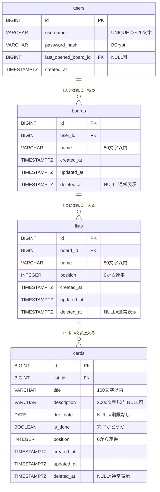

# DB設計書：タスク管理ツール（Trello風）

| 項目 | 内容 |
|---|---|
| ドキュメント版数 | 0.3（ドラフト） |
| 作成日 | 2026-09-20 |
| 最終更新日 | 2026-09-20 |
| 作成者 | （氏名） |
| ステータス | レビュー待ち |

> [要件定義書](01_requirements.md) の「8. データ要件」（[01-4](01-4_data-requirements.md)）を、PostgreSQL の実際のテーブルとして定義するドキュメントです。基本設計の第1段階にあたります。
> 使用する DBMS・ツールは [02 技術選定書](02_tech-stack.md) を参照してください。

---

## 1. 設計方針（先に決めたこと）

あとから変更しにくい3点を、次のように決めました。

| No | 決めたこと | 採用 | 理由 |
|---|---|---|---|
| 1 | 並び順の持ち方 | **整数（0 から始まる連番）＋移動時に再採番** | 値が常にきれいなので不具合に気づきやすい。1回の移動で複数行を更新するが、今回の規模（1リスト数十枚）では性能上の問題がない |
| 2 | 主キーの型 | **BIGINT の自動連番（IDENTITY 列）** | URL・API・ログが短く読みやすく、デバッグしやすい。他人の ID を推測できてしまう弱点は、すべての処理で「ログイン中の利用者のデータか」を確認する設計（要件 6.1）で防ぐ |
| 3 | ゴミ箱（論理削除）の持ち方 | **削除されたデータ自身にだけ `deleted_at` を入れる（子には伝播させない）** | 下の 1.1 で詳しく説明します |

### 1.1 ゴミ箱をどう表すか（重要）

業務ルール [5.3](01-3_business-rules.md#53-削除のルールゴミ箱) には、次の2つが書かれています。

- 親をゴミ箱へ移動すると、中のデータも一緒にゴミ箱へ入る（ゴミ箱には**親の1件として**表示する）
- 親を元に戻すと、中のデータも**一緒に**元に戻る

ここで「ボードを削除したとき、中のリスト・カードの `deleted_at` にも日時を書き込む」方式（伝播させる方式）を選ぶと、次の不具合が起きます。

> 例：カードAを個別に削除 → そのあとボードごと削除 → ボードを元に戻す
> → **カードAまで一緒に復活してしまう**（個別に捨てたはずのカードが戻ってくる）

「自分が直接削除されたのか、親が削除されたから隠れているのか」を区別できないためです。

そこで本設計では、**`deleted_at` は直接削除された行にだけ入れる**ことにします。表示のときは「自分と、親・祖父の `deleted_at` がすべて空か」を確認します。

| 表示する場所 | 条件 |
|---|---|
| ボード一覧 | `boards.deleted_at IS NULL` |
| ボード内のリスト | `lists.deleted_at IS NULL` かつ `boards.deleted_at IS NULL` |
| リスト内のカード | `cards.deleted_at IS NULL` かつ `lists.deleted_at IS NULL` かつ `boards.deleted_at IS NULL` |
| ゴミ箱のカード | `cards.deleted_at IS NOT NULL` かつ `lists.deleted_at IS NULL` かつ `boards.deleted_at IS NULL`<br>（親が捨てられている場合は、親の1件として表示されるので出さない） |
| ゴミ箱のリスト | `lists.deleted_at IS NOT NULL` かつ `boards.deleted_at IS NULL` |
| ゴミ箱のボード | `boards.deleted_at IS NOT NULL` |

この方式なら、**親を元に戻す＝親の `deleted_at` を空にするだけ**で、個別に捨てた子はゴミ箱に残ったまま、それ以外の子が元に戻ります。要件どおりの動きが自然に実現できます。

「完全に削除」は、行を本当に `DELETE` します。子も消す必要がありますが、これは外部キーの `ON DELETE CASCADE`（下記 3 章）が自動でやってくれます。

---

## 2. ER図



> `users.last_opened_board_id` は `boards` を指します（F-15「最後に開いていたボード」）。ER図が循環して読みにくくなるため、線は省略しています。

---

## 3. テーブル定義

共通の決めごとです。

- テーブル名・カラム名は**英小文字のスネークケース**（Spring Data JPA の既定の命名規則にそのまま合います）
- 日時は **`TIMESTAMPTZ`（タイムゾーン付き）** で、**UTC** で保存します。表示するときに日本時間へ変換します。公開先のサーバー（Render）とDB（Neon）が UTC 設定のため、ずれを防げます
- `due_date`（期限日）だけは時刻を持たないため `DATE` です（要件 5.1）
- 文字数の上限は DB 側（`VARCHAR`）とアプリ側（Bean Validation）の**両方**で持ちます。DB は最後の砦、アプリは利用者へのエラー表示のためです

### 3.1 users（利用者）

| カラム名 | 型 | NULL | 既定値 | 説明 |
|---|---|---|---|---|
| id | BIGINT | ✕ | 自動連番 | 主キー |
| username | VARCHAR(20) | ✕ | ― | ユーザーID。**一意**。半角英数字とアンダースコアのみ、4〜20文字。変更不可 |
| password_hash | VARCHAR(100) | ✕ | ― | BCrypt でハッシュ化したパスワード |
| last_opened_board_id | BIGINT | ◯ | NULL | 最後に開いていたボード（F-15）。未使用時・対象ボードが完全削除されたときは NULL |
| created_at | TIMESTAMPTZ | ✕ | `now()` | 登録日時 |

- `password_hash` は BCrypt の出力が60文字固定ですが、将来 Spring Security の `DelegatingPasswordEncoder`（`{bcrypt}` の接頭辞が付いて68文字）に切り替える可能性を考え、**余裕をもって 100** にしています
- パスワードそのものの形式チェック（8〜72文字、英字と数字を各1文字以上）は、ハッシュ化前のアプリ側でのみ行います。DB にはハッシュしか届かないためです
- ゴミ箱・退会の対象外なので、`deleted_at` は持ちません（要件 8.3）

### 3.2 boards（ボード）

| カラム名 | 型 | NULL | 既定値 | 説明 |
|---|---|---|---|---|
| id | BIGINT | ✕ | 自動連番 | 主キー |
| user_id | BIGINT | ✕ | ― | 所有者。`users.id` への外部キー |
| name | VARCHAR(50) | ✕ | ― | ボード名。空白だけは不可 |
| created_at | TIMESTAMPTZ | ✕ | `now()` | 作成日時。**サイドバーの並び順に使う**（新しい順／要件 5.2） |
| updated_at | TIMESTAMPTZ | ✕ | `now()` | 更新日時 |
| deleted_at | TIMESTAMPTZ | ◯ | NULL | ゴミ箱へ移動した日時。NULL は通常表示 |

### 3.3 lists（リスト）

| カラム名 | 型 | NULL | 既定値 | 説明 |
|---|---|---|---|---|
| id | BIGINT | ✕ | 自動連番 | 主キー |
| board_id | BIGINT | ✕ | ― | 所属ボード。`boards.id` への外部キー |
| name | VARCHAR(50) | ✕ | ― | リスト名。空白だけは不可 |
| position | INTEGER | ✕ | ― | 同じボード内での並び順。**0 から始まる連番**（左が小さい） |
| created_at | TIMESTAMPTZ | ✕ | `now()` | 作成日時 |
| updated_at | TIMESTAMPTZ | ✕ | `now()` | 更新日時 |
| deleted_at | TIMESTAMPTZ | ◯ | NULL | ゴミ箱へ移動した日時 |

### 3.4 cards（カード）

| カラム名 | 型 | NULL | 既定値 | 説明 |
|---|---|---|---|---|
| id | BIGINT | ✕ | 自動連番 | 主キー |
| list_id | BIGINT | ✕ | ― | 所属リスト。`lists.id` への外部キー。**移動すると変わる** |
| title | VARCHAR(100) | ✕ | ― | タイトル。空白だけは不可 |
| description | VARCHAR(2000) | ◯ | NULL | 説明文。改行を含められる |
| due_date | DATE | ◯ | NULL | 期限日。NULL は「期限日なし」 |
| is_done | BOOLEAN | ✕ | `false` | 完了かどうか |
| position | INTEGER | ✕ | ― | 同じリスト内での並び順。**0 から始まる連番**（上が小さい） |
| created_at | TIMESTAMPTZ | ✕ | `now()` | 作成日時 |
| updated_at | TIMESTAMPTZ | ✕ | `now()` | 更新日時 |
| deleted_at | TIMESTAMPTZ | ◯ | NULL | ゴミ箱へ移動した日時 |

> 完了したカードは並べ替えずその場に表示する（要件 5.2）ため、`is_done` は並び順に影響しません。

---

## 4. 制約・インデックス

### 4.1 外部キー

| 子 | 親 | 削除時の動作 | 理由 |
|---|---|---|---|
| boards.user_id | users.id | `ON DELETE CASCADE` | 退会機能は作らないが、整合性のために設定 |
| lists.board_id | boards.id | `ON DELETE CASCADE` | ボードを**完全に削除**したとき、中のリストも自動で消える（要件 5.3） |
| cards.list_id | lists.id | `ON DELETE CASCADE` | リストを**完全に削除**したとき、中のカードも自動で消える |
| users.last_opened_board_id | boards.id | `ON DELETE SET NULL` | 最後に開いていたボードを完全削除したら、記録を空にする |

### 4.2 一意制約

| 対象 | 制約 | 備考 |
|---|---|---|
| users.username | `UNIQUE` | 「このユーザーID は使われています」の判定に使う（要件 5.6） |
| lists (board_id, position) | `UNIQUE ... DEFERRABLE INITIALLY DEFERRED` | ↓ |
| cards (list_id, position) | `UNIQUE ... DEFERRABLE INITIALLY DEFERRED` | ↓ |

**`DEFERRABLE INITIALLY DEFERRED` が必要な理由**：並び順を再採番するとき、行を1つずつ更新していく途中で、一時的に同じ `position` が2行に並ぶ瞬間があります。通常の `UNIQUE` はその瞬間にエラーになりますが、`DEFERRABLE INITIALLY DEFERRED` にすると**チェックがトランザクションのコミット時まで延期**されるため、更新の順番を気にせず書けます。（並び順を整数の再採番方式にしたことで必要になった、実装上の重要なポイントです）

### 4.3 CHECK 制約（業務ルール 5.1 のうち、DB でも守るもの）

| 対象 | 制約 |
|---|---|
| users.username | `~ '^[A-Za-z0-9_]{4,20}$'`（形式と文字数） |
| boards.name / lists.name / cards.title | `btrim(...) <> ''`（空白だけの入力を禁止） |
| lists.position / cards.position | `>= 0` |

### 4.4 インデックス

| 名前 | 対象 | 何のため |
|---|---|---|
| （自動） | 主キー・一意制約 | PostgreSQL が自動で作る |
| idx_boards_user_created | boards (user_id, created_at DESC) | サイドバーのボード一覧（利用者ごと・新しい順） |
| idx_lists_board | lists (board_id) | ボードを開いたときのリスト取得 |
| idx_cards_list | cards (list_id) | リストのカード取得 |
| idx_boards_deleted | boards (user_id, deleted_at) WHERE deleted_at IS NOT NULL | ゴミ箱の一覧（部分インデックス。ゴミ箱に入っている行だけを対象にするので小さく済む） |
| idx_lists_deleted | lists (board_id, deleted_at) WHERE deleted_at IS NOT NULL | 同上 |
| idx_cards_deleted | cards (list_id, deleted_at) WHERE deleted_at IS NOT NULL | 同上 |

---

## 5. 主な操作とデータの動き

### 5.1 カードを別のリストへ移動する（ドラッグ＆ドロップ）

1つのトランザクションの中で、次を行います。

1. 移動元リストの、抜けた位置より後ろのカードを詰める（`position` を 0 から連番で振り直す）
2. 移動先リストの、落とした位置に挿入し、同じく 0 から連番で振り直す
3. 移動したカードの `list_id` と `position` を更新し、`updated_at` を現在時刻にする

> 同じリスト内での並び替えは、上記の 1・2 が同じリストになるだけです。

### 5.2 新しく作るとき

| 対象 | position の初期値 |
|---|---|
| リスト | そのボードの（ゴミ箱に入っていない）リスト数 → **一番右** |
| カード | そのリストの（ゴミ箱に入っていない）カード数 → **一番下** |

### 5.3 ゴミ箱へ移動する／元に戻す

| 操作 | やること |
|---|---|
| ゴミ箱へ移動 | その行の `deleted_at` に現在時刻を入れる。**残ったきょうだいの `position` は詰め直す**（連番を保つため） |
| 元に戻す | 親が生きているか確認 → `deleted_at` を NULL に戻し、`position` はきょうだいの最後尾に入れる |
| 完全に削除 | その行を `DELETE`。子は外部キーの `ON DELETE CASCADE` で自動的に消える |

> 「元に戻す」は、`position` を詰め直す設計上、元の並び位置を復元できません。**末尾（リストは一番右、カードは一番下）に戻す**動作で確定しています（要件 [01-3 5.3](01-3_business-rules.md#元に戻すときのルール) も更新済み）。

---

## 6. DDL（Flyway 用）

`backend/src/main/resources/db/migration/V1__create_tables.sql` として配置します。

```sql
-- V1__create_tables.sql

CREATE TABLE users (
    id                   BIGINT       GENERATED BY DEFAULT AS IDENTITY PRIMARY KEY,
    username             VARCHAR(20)  NOT NULL,
    password_hash        VARCHAR(100) NOT NULL,
    last_opened_board_id BIGINT,
    created_at           TIMESTAMPTZ  NOT NULL DEFAULT now(),
    CONSTRAINT uq_users_username UNIQUE (username),
    CONSTRAINT ck_users_username CHECK (username ~ '^[A-Za-z0-9_]{4,20}$')
);

CREATE TABLE boards (
    id         BIGINT      GENERATED BY DEFAULT AS IDENTITY PRIMARY KEY,
    user_id    BIGINT      NOT NULL,
    name       VARCHAR(50) NOT NULL,
    created_at TIMESTAMPTZ NOT NULL DEFAULT now(),
    updated_at TIMESTAMPTZ NOT NULL DEFAULT now(),
    deleted_at TIMESTAMPTZ,
    CONSTRAINT fk_boards_user FOREIGN KEY (user_id) REFERENCES users (id) ON DELETE CASCADE,
    CONSTRAINT ck_boards_name CHECK (btrim(name) <> '')
);

CREATE TABLE lists (
    id         BIGINT      GENERATED BY DEFAULT AS IDENTITY PRIMARY KEY,
    board_id   BIGINT      NOT NULL,
    name       VARCHAR(50) NOT NULL,
    position   INTEGER     NOT NULL,
    created_at TIMESTAMPTZ NOT NULL DEFAULT now(),
    updated_at TIMESTAMPTZ NOT NULL DEFAULT now(),
    deleted_at TIMESTAMPTZ,
    CONSTRAINT fk_lists_board FOREIGN KEY (board_id) REFERENCES boards (id) ON DELETE CASCADE,
    CONSTRAINT ck_lists_name CHECK (btrim(name) <> ''),
    CONSTRAINT ck_lists_position CHECK (position >= 0),
    CONSTRAINT uq_lists_board_position UNIQUE (board_id, position) DEFERRABLE INITIALLY DEFERRED
);

CREATE TABLE cards (
    id          BIGINT         GENERATED BY DEFAULT AS IDENTITY PRIMARY KEY,
    list_id     BIGINT         NOT NULL,
    title       VARCHAR(100)   NOT NULL,
    description VARCHAR(2000),
    due_date    DATE,
    is_done     BOOLEAN        NOT NULL DEFAULT false,
    position    INTEGER        NOT NULL,
    created_at  TIMESTAMPTZ    NOT NULL DEFAULT now(),
    updated_at  TIMESTAMPTZ    NOT NULL DEFAULT now(),
    deleted_at  TIMESTAMPTZ,
    CONSTRAINT fk_cards_list FOREIGN KEY (list_id) REFERENCES lists (id) ON DELETE CASCADE,
    CONSTRAINT ck_cards_title CHECK (btrim(title) <> ''),
    CONSTRAINT ck_cards_position CHECK (position >= 0),
    CONSTRAINT uq_cards_list_position UNIQUE (list_id, position) DEFERRABLE INITIALLY DEFERRED
);

-- users → boards は循環参照になるため、boards 作成後に追加する
ALTER TABLE users
    ADD CONSTRAINT fk_users_last_opened_board
    FOREIGN KEY (last_opened_board_id) REFERENCES boards (id) ON DELETE SET NULL;

-- インデックス
CREATE INDEX idx_boards_user_created ON boards (user_id, created_at DESC);
CREATE INDEX idx_lists_board         ON lists (board_id);
CREATE INDEX idx_cards_list          ON cards (list_id);

CREATE INDEX idx_boards_deleted ON boards (user_id, deleted_at) WHERE deleted_at IS NOT NULL;
CREATE INDEX idx_lists_deleted  ON lists (board_id, deleted_at) WHERE deleted_at IS NOT NULL;
CREATE INDEX idx_cards_deleted  ON cards (list_id, deleted_at)  WHERE deleted_at IS NOT NULL;
```

> `position` は PostgreSQL の**予約語ではありませんが**、SQL 標準では予約語に含まれます。上記のように単純な `SELECT`／`UPDATE` では問題なく使えますが、気になる場合は `sort_order` への改名を検討します（下記 7 章の No.3）。

---

## 7. 検討中・次工程で決めること

| No | 内容 | 現在の案 |
|---|---|---|
| 1 | ~~「元に戻す」で元の位置に戻すか、末尾に戻すか~~ | **解決（v0.2）：末尾に戻す**。元の位置を復元するには削除時の `position` を別途保存する必要があり、複雑さに見合わないため。要件側（01-2 F-42、01-3 5.3、01-1 UC-16、01_requirements 3.2）も更新済み |
| 2 | ~~ログインセッションの保存場所~~ | **解決（v0.3）：既定（サーバーのメモリ上）を使い、セッション用のテーブルは作らない**。Render の再起動・スリープで再ログインが必要になる制約を受け入れ、要件 5.6・F-08 側に明記した（[04 API設計書 1.1](04_api-design.md#11-セッションをメモリに持つことの制約要件への影響)）。確実な30日保持が必要になれば Spring Session JDBC を追加する |
| 3 | `position` というカラム名 | このまま使う案（SQL 標準の予約語だが PostgreSQL では問題なく動く） |
| 4 | テストデータ（開発用の初期データ） | Flyway の `V2__insert_test_data.sql`、または `src/test/resources` に置く案 |

---

## 改訂履歴
| 版数 | 日付 | 内容 | 作成者 |
|---|---|---|---|
| 0.3 | 2026-09-20 | 検討事項 No.2（セッションの保存場所）を「既定のメモリ保存・専用テーブルなし」で確定 | |
| 0.2 | 2026-09-20 | 検討事項 No.1 を「末尾に戻す」で確定し、要件定義書側（01-1・01-2・01-3・01-4・01本体）に反映 | |
| 0.1 | 2026-09-20 | 初版作成。並び順（整数＋再採番）、主キー（BIGINT 連番）、ゴミ箱（deleted_at を伝播させない）を決定し、4テーブルの定義と DDL を記載 | |

---

[↑ 要件定義書に戻る](01_requirements.md) ／ [02 技術選定書](02_tech-stack.md)
