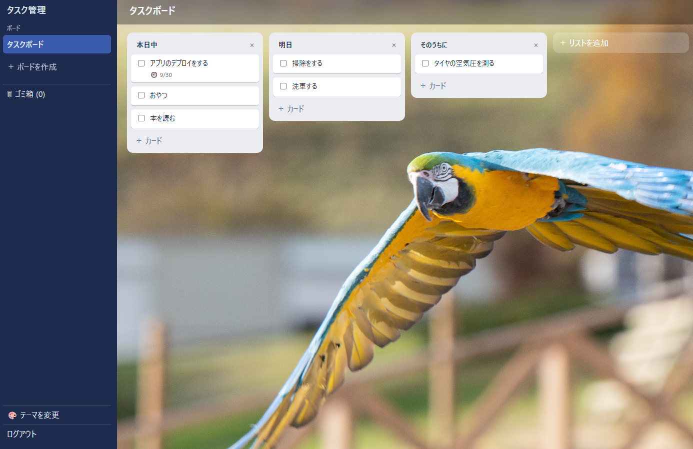

# タスク管理ツール（Trello風）

プログラミングスクールの課題として開発している、Trello 風のタスク管理 Web アプリです。
「ボード・リスト・カード」の形でタスクを見える化し、ドラッグ＆ドロップで進み具合を管理できます。



*メイン画面（背景テーマに画像を設定した状態）。左のサイドバーでボードの切り替え・ゴミ箱・テーマの変更を行い、右の表示エリアでリストとカードを操作します。*

**現在の進捗：Ver.1.0デプロイ済み（公開はしない）**

---

## このリポジトリについて

スクール課題として、**実務の開発フローをそのままなぞること** を目的にしています。
いきなりコードを書くのではなく、次の順番で工程を進め、各工程の成果物をドキュメントとして残しています。

| フェーズ | 成果物 | 状態 |
|---|---|---|
| 要件定義 | [01 要件定義書](docs/01_requirements.md) ＋ 分割ドキュメント（01-1〜01-5） | ✅ 完了 |
| プロトタイプ | [prototype/](prototype/)（HTML／CSS／JavaScript） | ✅ 完了 |
| 技術選定 | [02 技術選定書](docs/02_tech-stack.md) | ✅ 完了 |
| 基本設計 | [03 DB設計書](docs/03_db-design.md)、[04 API設計書](docs/04_api-design.md)、[05 画面設計書](docs/05_screen-design.md) | ✅ 完了 |
| 実装（バックエンド） | `backend/`（Spring Boot）。認証・ボード・リスト・カード・ゴミ箱の API | ✅ 完了（テストも通過） |
| 実装（フロントエンド） | `frontend/`（React）。S-01 メイン画面、S-02 ログイン、S-03 新規登録 | ✅ 完了（テストも通過） |
| テスト | [06 テスト仕様書](docs/06_test-spec.md)（テスト項目表・結果） | ✅ 完了（142項目すべて OK） |
| リリース | AWS（EC2・RDS）へのデプロイ。[07 デプロイ手順書](docs/07_deployment.md) | ✅ 完了（公開はしない） |
| 機能追加 | 背景テーマ（要件定義からテストまで同じ工程で実施） | ✅ 完了 |

> ドキュメントは「お客様に説明し、合意をいただくための資料」という想定で日本語で書いています。
> 判断に迷った箇所は、選ばなかった案とその理由も残すようにしています。

---

## ドキュメント

| No | ドキュメント | 内容 |
|---|---|---|
| 01 | [要件定義書](docs/01_requirements.md) | 概要・スコープ・非機能要件・受け入れ基準・未決事項 |
| 01-1 | [ユースケース](docs/01-1_use-cases.md) | アクター、ユースケース一覧・記述 |
| 01-2 | [機能要件](docs/01-2_functional-requirements.md) | 機能一覧（ID・内容・優先度） |
| 01-3 | [業務ルール](docs/01-3_business-rules.md) | 入力・表示・削除・保存・ログイン・背景テーマのルール |
| 01-4 | [データ要件](docs/01-4_data-requirements.md) | データ一覧・関係図・データの流れ |
| 01-5 | [用語集](docs/01-5_glossary.md) | アプリ・開発・技術の用語 |
| 02 | [技術選定書](docs/02_tech-stack.md) | 使用技術・システム構成・認証方式 |
| 03 | [DB設計書](docs/03_db-design.md) | ER図・テーブル定義・DDL |
| 04 | [API設計書](docs/04_api-design.md) | エンドポイント一覧・JSON・エラー形式 |
| 05 | [画面設計書](docs/05_screen-design.md) | 画面遷移図・画面項目定義・メッセージ一覧 |
| 06 | [テスト仕様書](docs/06_test-spec.md) | テスト項目表（142項目）・テスト環境・実施結果 |
| 07 | [デプロイ手順書](docs/07_deployment.md) | AWS の構成と、そう決めた理由・費用・運用手順 |

最初に読むなら [01 要件定義書](docs/01_requirements.md) から、実装の全体像を知りたい場合は [02 技術選定書](docs/02_tech-stack.md) からどうぞ。

---

## 主な機能

- ボード・リスト・カードの作成、表示、**その場での編集**、削除
- ドラッグ＆ドロップでのカード移動・リスト並び替え・ボード並び替え
- カードの完了チェック（取り消し線と薄い色で表示）
- カードの期限日の設定と、期限切れの色表示
- ゴミ箱（削除 → 元に戻す／完全に削除の2段階）
- サーバーへの自動保存（保存ボタンはなし）
- アカウントの新規登録・ログイン・ログアウト
- **背景テーマの変更**：サイドバーと表示エリアの2色を、テンプレート5種類またはカスタムカラー（RGB 指定）から選べる。画像をアップロードして背景にもできる

詳細は [01-2 機能要件](docs/01-2_functional-requirements.md) を参照してください。

---

## 技術スタック

バックエンド・フロントエンド・DB は課題での指定、それ以外は [02 技術選定書](docs/02_tech-stack.md) で選定しています。

| 区分 | 技術 |
|---|---|
| バックエンド | Java 21 / Spring Boot（Spring Web、Spring Data JPA、Spring Security、Bean Validation） |
| ビルド | Gradle（Kotlin DSL） |
| データベース | PostgreSQL 17（マイグレーションは Flyway） |
| フロントエンド | React / TypeScript / Vite（TanStack Query、dnd-kit、CSS Modules） |
| テスト | JUnit 5・Mockito・Testcontainers / Vitest・React Testing Library |
| 品質チェック | Spotless・Checkstyle / oxlint・Prettier（Pull Request ごとに GitHub Actions で自動実行） |
| 公開先 | AWS（EC2・RDS・ECR）。インフラは Terraform で管理 |
| 自動デプロイ | GitHub Actions（`main` へのマージで本番に反映） |

---

## フォルダ構成

```
TaskManegementTool/
├── README.md          … このファイル
├── docs/              … 要件定義・設計ドキュメント・デプロイ手順書
├── prototype/         … 画面イメージ確認用の試作（HTML／CSS／JavaScript）
├── backend/           … Spring Boot（Gradle）
├── frontend/          … React（Vite）
├── infra/terraform/   … AWS のインフラ定義（Terraform）
├── .github/workflows/ … CI（品質チェック）と自動デプロイ
├── Dockerfile         … 画面と API を1つにまとめる本番用イメージ
└── compose.yaml       … 開発用 PostgreSQL
```

---

## 開発環境の動かし方

必要なもの：JDK 21、Node.js 24、Docker Desktop（Windows では WSL2 も必要）。

### 1. データベースを起動する

```bash
docker compose up -d
```

PostgreSQL 17 が `localhost:5432` で起動します（DB 名・ユーザー・パスワードはすべて `taskboard`）。
止めるときは `docker compose down`、データごと消すときは `docker compose down -v` です。

### 2. バックエンドを起動する

```bash
cd backend
./gradlew bootRun --args='--spring.profiles.active=local'
```

`http://localhost:8080` で起動します。テーブルは起動時に Flyway が自動で作ります。
`local` プロファイルは、開発中（HTTP）でもログイン用の Cookie が届くようにするための指定です。

- API を画面から試す：[http://localhost:8080/swagger-ui.html](http://localhost:8080/swagger-ui.html)（開発環境のみ）
- テストを流す：`./gradlew check`（整形・Checkstyle・テスト。Testcontainers が PostgreSQL を起動するので Docker が必要）

### 3. フロントエンドを起動する

```bash
cd frontend
npm install
npm run dev
```

[http://localhost:5173](http://localhost:5173) で開きます。`/api` への通信はバックエンドへ自動で転送されます。
テストは `npm run check && npm run build`（型・lint・整形・テスト・ビルド）で流します。

---

## 本番環境（AWS）

```
 作業する PC（許可した IP のみ）
      │ HTTP
      ▼
 ┌─ AWS（東京リージョン）───────────────────────────┐
 │  EC2（Docker）                                    │
 │   └ アプリのコンテナ（画面 ＋ API）                 │
 │            │                                      │
 │            ▼                                      │
 │  RDS for PostgreSQL（外部から直接つながらない場所）  │
 └───────────────────────────────────────────────────┘
       ▲
       │ main にマージされると、GitHub Actions がビルドして ECR に置き、EC2 のアプリを入れ替える
```

| 項目 | 内容 |
|---|---|
| 構成 | EC2 1台の上で、画面と API を1つにまとめたコンテナを動かす。データベースは RDS |
| インフラの管理 | Terraform（`infra/terraform/`）。同じ構成をコマンド1つで作り直せる |
| デプロイ | `main` へのマージで自動。起動後の死活確認に失敗したらワークフローが失敗する |
| 公開範囲 | 作業する PC の IP アドレスからのみアクセスできる（課題の指示による）。URL は公開していない |
| 稼働 | 常時は動かさず、作業するときだけ起動する |

構成を選んだ理由・費用・止め方と再開のしかたは [07 デプロイ手順書](docs/07_deployment.md) にまとめています。

---

## プロトタイプの見かた

`prototype/index.html` をブラウザで開くだけで動きます（サーバー・ビルドは不要）。
見た目とカード・リストの動きを確認するためのもので、データはブラウザを閉じると消えます。本番の実装には使いません。

---

## 制約事項

- 対応するブラウザは PC の Google Chrome です。スマートフォン・タブレットでの表示には対応していません
- パスワードの再設定・退会はできません（メール送信の仕組みが必要になるため）。パスワードを忘れるとデータを開けなくなります（新規登録画面に注意書きを表示します）
- ボードの共有や、複数人での同時編集はできません
- サーバーを再起動するとログイン状態が解除され、もう一度ログインが必要になります
- 通信は HTTPS ではなく HTTP です。アクセスできる IP アドレスを限定することで補っています
- 学習用の課題として作成しているため、運用・保守（障害対応、問い合わせ対応）は対象外です
