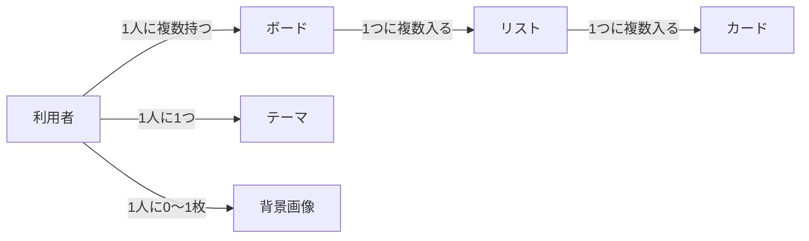

# 01-4 データ要件：タスク管理ツール（Trello風）

> [要件定義書（本体）](01_requirements.md) の「8. データ要件」の詳細です。
> ここでは「どんなデータを持ち、どうつながっているか」を定めます。
> 項目の細かい形式（保存するデータの構造）は、基本設計・詳細設計で決めます。

### 8.1 データの一覧
| データ | 何を表すか | 持つ情報 |
|---|---|---|
| 利用者 | アプリのアカウント1つ | ユーザーID、パスワード（ハッシュ化したもの）、作成日時、最後に開いていたボード |
| テーマ | 利用者が選んだ背景（F-61〜66） | 種類（既定・テンプレート・カスタムカラー・背景画像）、テンプレートの名前、カスタムカラーの2色、更新日時 |
| 背景画像 | 利用者がアップロードした画像（F-64） | 画像のデータ、形式（JPEG・PNG・WebP）、大きさ、アップロード日時 |
| ボード | プロジェクト単位の作業スペース | ボード名、所属する利用者、作成日時、更新日時、削除日時 |
| リスト | ボードの中の列 | リスト名、所属するボード、並び順、作成日時、更新日時、削除日時 |
| カード | 1件のタスク | タイトル、説明文、**期限日**、**完了かどうか**、所属するリスト、並び順、作成日時、更新日時、削除日時 |

- **削除日時**：ゴミ箱に入れた日時。空のときは「ゴミ箱に入っていない（通常の表示）」を表す。ゴミ箱は、削除日時が入っているデータの一覧として表示する
- **期限日**：カードの締め切りの日付（時刻は持たない）。空のときは「期限日なし」を表す
- **ユーザーID**：利用者が登録時に決める、ログインに使う名前。重複はできません。氏名・メールアドレスなどの個人情報は持ちません
- **パスワード**：そのままでは保存せず、元に戻せない形（ハッシュ化）にして保存します。そのため、パスワードを忘れても調べることはできません
- 「最後に開いていたボード」（F-15）は、利用者の情報として保存します
- **テーマ**：利用者1人につき1つ。一度もテーマを変えていない利用者は「既定」として扱います。カスタムカラーの2色は、テンプレートや画像に切り替えても残しておき、次にカスタムカラーを開いたときの初期値にします
- **背景画像**：利用者1人につき0〜1枚。テーマの種類を切り替えても消さず、利用者が削除するかアップロードし直したときだけ消えます。画像もデータベースに保存します

### 8.2 データ同士の関係

| 関係 | 説明 |
|---|---|
| 利用者 と ボード | 1人の利用者（アカウント）は、ボードを0個以上持てる。ボードは必ず1人の利用者に属する |
| ボード と リスト | 1つのボードには、リストを0個以上入れられる。リストは必ず1つのボードに入る |
| リスト と カード | 1つのリストには、カードを0枚以上入れられる。カードは必ず1つのリストに入る |
| 利用者 と テーマ | 1人の利用者は、テーマを1つ持つ（変えていなければ既定） |
| 利用者 と 背景画像 | 1人の利用者は、背景画像を0枚または1枚持つ |

> ゴミ箱に入れても、所属するボード・リストの情報は残します。「元に戻す」で元の場所に戻すためです。
> ただし**並び順は削除時に詰め直す**ため、元に戻したリスト・カードは末尾に入ります（[01-3 業務ルール 5.3](01-3_business-rules.md#元に戻すときのルール)）。

### 8.3 データの流れ（作成・更新・削除のタイミング）
| データ | 作成されるとき | 更新されるとき | ゴミ箱へ移動するとき（削除日時が入る） | 完全に削除されるとき |
|---|---|---|---|---|
| 利用者 | 新規登録をしたとき | 最後に開いていたボードが変わったとき | ―（ゴミ箱の対象外） | ―（退会機能は作らない） |
| テーマ | 初めてテーマを適用したとき | テーマを適用したとき／既定に戻したとき／使っている背景画像を削除したとき（既定になる） | ―（ゴミ箱の対象外） | ―（利用者と同じく消さない） |
| 背景画像 | 初めて画像をアップロードしたとき | 画像をアップロードし直したとき（置き換わる） | ―（ゴミ箱の対象外） | パネルで「画像を削除」したとき |
| ボード | ボードを作成したとき | ボード名を変更したとき／元に戻したとき（削除日時が空になる） | ボードを削除したとき | ゴミ箱で完全に削除したとき／ゴミ箱を空にしたとき |
| リスト | リストを作成したとき | リスト名を変更したとき／**並び替えたとき（並び順が変わる）**／元に戻したとき | リストを削除したとき／ボードをゴミ箱へ移動したとき | ゴミ箱で完全に削除したとき／ゴミ箱を空にしたとき／ボードが完全に削除されたとき |
| カード | カードを作成したとき（期限日は空） | タイトル・説明文を編集したとき／**期限日を設定・変更・削除したとき**／**完了・未完了を切り替えたとき**／**移動したとき（所属リストと並び順が変わる）**／元に戻したとき | カードを削除したとき／リストやボードをゴミ箱へ移動したとき | ゴミ箱で完全に削除したとき／ゴミ箱を空にしたとき／リストやボードが完全に削除されたとき |

### 8.4 データの保存先と見られる人
- すべてのデータは、サーバーのデータベース（PostgreSQL）に保存する
- データを見る・操作することができるのは、そのデータを作ったアカウントでログインしている人だけ。サーバーは、ログイン中の利用者に紐づくデータだけを返す
- ログインすれば、別のパソコン・別のブラウザからでも同じデータを開ける
- パスワードはハッシュ化して保存するため、管理者を含め、誰も元のパスワードを読み出せない
- 背景画像も他のデータと同じく、アップロードした本人だけが表示できる
- 保存のルールは [01-3 業務ルール 5.4](01-3_business-rules.md#54-保存のルール) を参照

---

[↑ 要件定義書（本体）に戻る](01_requirements.md)
