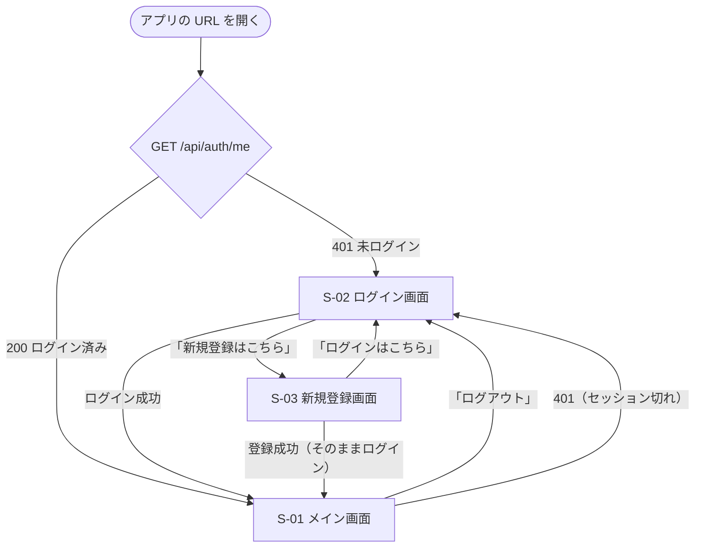

# 画面設計書：タスク管理ツール（Trello風）

| 項目 | 内容 |
|---|---|
| ドキュメント版数 | 0.1（ドラフト） |
| 作成日 | 2026-09-20 |
| 最終更新日 | 2026-09-20 |
| 作成者 | （氏名） |
| ステータス | レビュー待ち |

> [要件定義書 7. 画面一覧](01_requirements.md#7-画面一覧概要) を、実装できる細かさまで具体化するドキュメントです。基本設計の第3段階です。
> 見た目（配色・余白・角丸）は [prototype/](../prototype/) の `style.css` を踏襲します。本書では **画面の構成・項目・状態・メッセージ** を定めます。
> 呼び出す API は [04 API設計書](04_api-design.md)、データは [03 DB設計書](03_db-design.md) を参照してください。

---

## 1. 設計方針

| No | 方針 | 理由 |
|---|---|---|
| 1 | 画面は3つだけ（S-01／S-02／S-03）。**ボードの表示・編集はすべて S-01 の中で完結**する | 画面の行き来をなくし、すぐ作業に入れるため（要件 v0.8） |
| 2 | 編集は**その場編集**（クリックした場所が入力欄に変わる）。モーダルや別画面は開かない | プロトタイプで確認した結果、モーダルは操作が重かったため（要件 v0.10） |
| 3 | モーダルを使うのは「完全に削除」の**確認ダイアログだけ** | 取り消せない操作のみ、意図的に手を止めてもらう（業務ルール 5.3） |
| 4 | 画面は**PC のブラウザ幅（1024px 以上）前提**。スマホ対応はしない | 要件 2.2 で対象外 |
| 5 | 保存ボタンは置かない。操作したらすぐ保存し、**先に画面を更新**してから通信する（楽観的更新） | 要件 F-01。操作の手応えを速くするため |

---

## 2. 画面一覧

| ID | 画面名 | 表示するタイミング | 対応する要件 |
|---|---|---|---|
| S-01 | メイン画面 | ログイン済みでアプリを開いたとき | F-11〜F-44 |
| S-02 | ログイン画面 | 未ログイン、ログアウト後、セッション切れ | F-06、F-08 |
| S-03 | 新規登録画面 | S-02 のリンクから | F-05 |

画面として数えないもの：**確認ダイアログ**（7章）、**トースト通知**（8章）。

---

## 3. 画面遷移図



| 遷移 | 補足 |
|---|---|
| 401 → S-02 | どの操作中でも、401 が返ったらログイン画面へ戻し、「ログインの有効期限が切れました。もう一度ログインしてください」と表示する（業務ルール 5.6） |
| S-02／S-03 ↔ | 入力内容は引き継がない |
| 登録成功 → S-01 | 確認画面や「登録しました」の画面は挟まず、そのままメイン画面を表示する（業務ルール 5.6） |

> サーバーが再起動・スリープしたときも 401 になり、S-02 へ戻ります（[04 API設計書 1.1](04_api-design.md#11-セッションをメモリに持つことの制約要件への影響)）。

---

## 4. S-01 メイン画面

### 4.1 レイアウト

```
┌────────────────┬──────────────────────────────────────────────────┐
│ タスク管理      │  課題制作 ✏                        [ボードを削除] │ ← ヘッダー
│                │ ┌──────────┐ ┌──────────┐ ┌──────────┐          │
│ ボード          │ │ 未着手 ✏ │ │ 作業中 ✏ │ │ 完了   ✏ │          │
│ ▶ 課題制作      │ │ ┌──────┐ │ │ ┌──────┐ │ │ ┌──────┐ │          │
│   家事          │ │ │☐ 設計│ │ │ │☐ 実装│ │ │ │☑ 要件│ │  ＋リストを追加
│   勉強          │ │ │ 9/30 │ │ │ └──────┘ │ │ └──────┘ │          │
│                │ │ └──────┘ │ │          │ │          │          │
│ ＋ ボードを作成  │ │ ＋ カード │ │ ＋ カード │ │ ＋ カード │          │
│ ───────────── │ └──────────┘ └──────────┘ └──────────┘          │
│ 🗑 ゴミ箱 (2)   │                                                  │
│ ───────────── │                                                  │
│ ログアウト      │                                                  │
└────────────────┴──────────────────────────────────────────────────┘
   サイドバー(固定幅 240px)          表示エリア(残り幅・横スクロール)
```

- サイドバーは**固定**、表示エリアはリストが増えたら**横スクロール**する
- リスト内のカードが増えたら、**リストごとに縦スクロール**する（ヘッダーと「＋ カード」は残す）

### 4.2 サイドバーの項目

| No | 項目 | 種類 | 内容・動作 | 要件 |
|---|---|---|---|---|
| 1 | アプリ名「タスク管理」 | 見出し | 押しても何も起きない | ― |
| 2 | ボード一覧 | リンクの一覧 | 作成日の新しい順。押すと表示エリアがそのボードに切り替わる。表示中のボードは背景色で強調 | F-11、F-15 |
| 3 | ＋ ボードを作成 | ボタン | 押すと一覧の末尾に入力欄が現れる。確定で作成し、**そのボードを表示する** | F-12 |
| 4 | 🗑 ゴミ箱 (件数) | ボタン | 押すと表示エリアがゴミ箱に切り替わる。件数は 0 件のときも `(0)` と表示する | F-41 |
| 5 | ログアウト | ボタン | 確認は出さず、すぐログアウトして S-02 へ | F-07 |

- ボード一覧が0件のときは、一覧の位置に「ボードがありません。新しく作成しましょう」と薄い文字で表示する（業務ルール 5.2）
- ボード名が長いときは、幅で省略表示（`...`）にし、`title` 属性で全文を出す

### 4.3 表示エリア：ボードを表示しているとき

| No | 項目 | 種類 | 内容・動作 | 要件 |
|---|---|---|---|---|
| 1 | ボード名 | 見出し／その場編集 | 押すと入力欄に変わる。50文字以内・空白だけ不可 | F-13 |
| 2 | ボードを削除 | ボタン | 確認なしでゴミ箱へ移動。移動後はサイドバーの次のボードを表示する（無ければ「ボードがありません」） | F-14 |
| 3 | リスト | 列 | 左から `position` 順。**ヘッダーをドラッグ**して並び替える | F-24 |
| 4 | リスト名 | その場編集 | 50文字以内・空白だけ不可 | F-22 |
| 5 | リストの削除 | ボタン（リストヘッダー内） | 確認なしでゴミ箱へ（中のカードごと） | F-23 |
| 6 | カード | カード | 上から `position` 順。**ドラッグで移動**（同じリスト内・別のリストへ） | F-34 |
| 7 | ＋ カード | ボタン | リストの一番下に入力欄が現れる。タイトルを入れて確定で追加。**続けて追加できるよう入力欄は開いたままにする** | F-31 |
| 8 | ＋ リストを追加 | ボタン | 一番右に入力欄が現れる | F-21 |

リストが0個のときは、表示エリアに「リストがありません。「＋ リストを追加」から作成しましょう」と表示します。

### 4.4 カードの表示

```
┌────────────────────────────┐
│ ☐  画面設計書を書く          │ ← チェックボックス ＋ タイトル
│    メイン画面のレイアウト…   │ ← 説明文（1行に省略。無ければ非表示）
│    🕘 9/30                  │ ← 期限日（無ければ非表示）
└────────────────────────────┘
```

| 項目 | 表示のルール | 要件 |
|---|---|---|
| チェックボックス | 押すと完了・未完了を切り替える。カードのその場編集は開かない | F-38 |
| タイトル | 押すとその場編集になる。100文字以内・空白だけ不可 | F-32 |
| 説明文 | 1行に省略して表示。空のときは行ごと表示しない | F-32 |
| 期限日 | `M/D` 形式で表示。空のときは表示しない | F-35 |
| 完了したカード | タイトルに**取り消し線**、カード全体を**薄い色**にする。並び順は変えない | F-38、業務ルール 5.2 |
| 期限切れ | **未完了かつ期限日が今日より前**のとき、期限日を赤系の色と太字にする。**当日は期限切れにしない** | F-35 |
| 完了した期限切れ | 目立たせない（通常の色に戻す） | 業務ルール 5.2 |

> 期限切れの判定は**画面側**で行います（サーバーは `dueDate` と `isDone` を返すだけ／[04 API設計書 4.5](04_api-design.md#45-get-apiboardsboardid画面表示用入れ子)）。利用者のパソコンの日付を基準にします。

### 4.5 カードのその場編集

カードを押すと、そのカードが編集状態に変わります。

```
┌────────────────────────────┐
│ ☐ [画面設計書を書く_______] │ ← タイトル（1行入力）
│   [メイン画面のレイアウト  ] │ ← 説明文（複数行入力）
│   [           　　　      ] │
│   期限日 [2026-09-30] [×]   │ ← 日付入力 ＋ 期限日を消すボタン
│              [保存] [取消]  │
└────────────────────────────┘
```

| 操作 | 動作 | 要件 |
|---|---|---|
| タイトルで Enter | 確定する | 業務ルール 5.5 |
| 説明文で Enter | **改行**する（確定しない） | 業務ルール 5.5 |
| 「保存」／カードの外を押す | 確定する | 業務ルール 5.5 |
| Esc ／「取消」 | 変更を破棄して表示に戻す | 業務ルール 5.5 |
| 別のカードを押す | 編集中のカードを**確定してから**切り替える（同時に編集できるのは1枚だけ） | 業務ルール 5.5 |
| 期限日の「×」 | 期限日を空にする（`dueDate: null` で送る） | F-35 |

確定時は [PUT /api/cards/{cardId}](04_api-design.md#411-put-apicardscardidカードの更新) を**4項目すべて**送って呼びます。内容が1文字も変わっていない場合は通信しません。

### 4.6 表示エリア：ゴミ箱を表示しているとき

```
┌──────────────────────────────────────────────────────────┐
│ ゴミ箱 (2)                              [ゴミ箱を空にする] │
├────────┬──────────────┬────────────────┬────────────────┤
│ 種類    │ 名前         │ 元の場所        │ 削除日時        │
├────────┼──────────────┼────────────────┼────────────────┤
│ カード  │ 要件定義を書く │ 課題制作 ＞ 未着手│ 9/20 12:00 [元に戻す][完全に削除] │
│ リスト  │ 作業中        │ 課題制作        │ 9/19 19:00 [元に戻す][完全に削除] │
└────────┴──────────────┴────────────────┴────────────────┘
```

| No | 項目 | 内容 | 要件 |
|---|---|---|---|
| 1 | 種類 | 「ボード」「リスト」「カード」 | F-41 |
| 2 | 名前 | ボード名・リスト名・カードのタイトル | F-41 |
| 3 | 元の場所 | API の `originalLocation`。ボードは「―」 | F-41 |
| 4 | 削除日時 | `M/D HH:mm`（日本時間に変換して表示） | F-41 |
| 5 | 元に戻す | 押すと戻す。`restorable` が false のときは**押せない状態**にし、理由を `title` で出す | F-42 |
| 6 | 完全に削除 | **確認ダイアログ**のあと削除 | F-43 |
| 7 | ゴミ箱を空にする | **確認ダイアログ**のあと全件削除。0件のときは押せない | F-44 |

- 並び順は削除日時の新しい順（業務ルール 5.2）
- 0件のときは表の代わりに「ゴミ箱は空です」と表示する（業務ルール 5.2）
- 親がゴミ箱にある子は表示しない（親の1件として表示する／業務ルール 5.3）

---

## 5. S-02 ログイン画面

```
        ┌──────────────────────────────┐
        │        タスク管理             │
        │                              │
        │ ユーザーID                    │
        │ [__________________________] │
        │ パスワード                    │
        │ [__________________________] │
        │                              │
        │ ⚠ ユーザーID またはパスワード   │ ← エラー時のみ
        │   が違います                  │
        │                              │
        │        [  ログイン  ]         │
        │                              │
        │   アカウントをお持ちでない方は  │
        │       新規登録はこちら         │
        └──────────────────────────────┘
```

| No | 項目 | 種類 | 必須 | ルール | 備考 |
|---|---|---|---|---|---|
| 1 | ユーザーID | 1行入力 | ◯ | 4〜20文字 | 自動で先頭にカーソルを置く |
| 2 | パスワード | パスワード入力 | ◯ | 8〜72文字 | **伏せ字で表示**（業務ルール 5.1） |
| 3 | ログイン | ボタン | ― | ― | 通信中は押せない状態にし「ログイン中…」と表示 |
| 4 | 新規登録はこちら | リンク | ― | ― | S-03 へ |

- Enter キーでも送信できるようにする（`<form>` を使う）
- 未入力のまま押したときは、通信せず「ユーザーID を入力してください」等を入力欄の近くに出す
- 認証失敗（401）のときは、**どちらが違うかは書かず**「ユーザーID またはパスワードが違います」をフォーム上部に表示する（業務ルール 5.6）
- セッション切れで遷移してきたときは「ログインの有効期限が切れました。もう一度ログインしてください」を表示する

## 6. S-03 新規登録画面

| No | 項目 | 種類 | 必須 | ルール（業務ルール 5.1） |
|---|---|---|---|---|
| 1 | ユーザーID | 1行入力 | ◯ | 4〜20文字。半角英数字とアンダースコアのみ。**あとから変更できない**旨を補足表示 |
| 2 | パスワード | パスワード入力 | ◯ | 8〜72文字。英字と数字をそれぞれ1文字以上 |
| 3 | パスワード（確認用） | パスワード入力 | ◯ | 1と一致すること。**画面側だけで確認し、API には送らない** |
| 4 | 登録する | ボタン | ― | 通信中は押せない状態 |
| 5 | 注意書き | 文章 | ― | 「**パスワードを忘れるとデータを開けなくなります。** 再設定はできません」を**登録ボタンの上**に常時表示（業務ルール 5.6） |
| 6 | ログインはこちら | リンク | ― | S-02 へ |

- 入力チェックは**入力欄を離れたとき**に行い、該当の入力欄の近くにメッセージを出す（業務ルール 5.1）
- ユーザーID の重複は登録を押すまで分からない（409）。その場合はユーザーID の欄に「このユーザーID は使われています」を出す
- 成功すると、そのままログイン状態で S-01 を表示する

---

## 7. 確認ダイアログ

「完全に削除」「ゴミ箱を空にする」のときだけ表示します（業務ルール 5.3）。

| 操作 | メッセージ | ボタン |
|---|---|---|
| 完全に削除（カード） | 「『（タイトル）』を完全に削除します。元に戻せません。削除しますか？」 | [キャンセル] [完全に削除する] |
| 完全に削除（リスト） | 「『（リスト名）』と中のカードを完全に削除します。元に戻せません。削除しますか？」 | 同上 |
| 完全に削除（ボード） | 「『（ボード名）』と中のリスト・カードを完全に削除します。元に戻せません。削除しますか？」 | 同上 |
| ゴミ箱を空にする | 「ゴミ箱の（件数）件をすべて完全に削除します。元に戻せません。削除しますか？」 | [キャンセル] [完全に削除する] |

- 初期フォーカスは**キャンセル**に置く（誤って Enter を押しても削除されないように）
- Esc キーとダイアログ外のクリックでキャンセルできる
- 実行ボタンは危険色（赤系）にする
- ゴミ箱へ移動するだけの削除には**出さない**

---

## 8. メッセージ一覧

### 8.1 エラー・通知（トースト：画面右下に数秒表示）

| きっかけ | 表示 | 種類 |
|---|---|---|
| 保存の通信に失敗（500・ネットワーク断） | 「保存できませんでした。通信の状態を確認して、もう一度お試しください」＋[再試行] | エラー（F-04） |
| 読み込みの通信に失敗 | 「データを読み込めませんでした」＋[再読み込み] | エラー（F-04） |
| 401（セッション切れ） | 「ログインの有効期限が切れました。もう一度ログインしてください」→ S-02 へ | エラー |
| 403（CSRF） | 「操作を完了できませんでした。ページを再読み込みしてください」 | エラー |
| 404（他人のデータ・削除済み） | 「データが見つかりません。画面を再読み込みします」 | エラー |
| カードを戻したが元のリストがない | 「元のリストがないため、一番左のリストに戻しました」 | お知らせ |
| リストを戻せない（409） | 「元のボードがないため戻せません」 | エラー |

通信が失敗したときは、**先に更新していた画面を元の状態へ戻します**（楽観的更新の取り消し）。

### 8.2 入力エラー（入力欄の近くに表示）

| 項目 | 条件 | メッセージ |
|---|---|---|
| ユーザーID | 未入力 | ユーザーID を入力してください |
| ユーザーID | 文字数・形式違反 | ユーザーID は半角英数字とアンダースコアで4〜20文字で入力してください |
| ユーザーID | 重複（409） | このユーザーID は使われています |
| パスワード | 未入力 | パスワードを入力してください |
| パスワード | ルール違反 | パスワードは英字と数字を含む8文字以上で入力してください |
| パスワード（確認用） | 不一致 | パスワードが一致しません |
| ボード名／リスト名 | 空白だけ | 名前を入力してください |
| ボード名／リスト名 | 51文字以上 | 50文字以内で入力してください |
| カードのタイトル | 空白だけ | タイトルを入力してください |
| カードのタイトル | 101文字以上 | 100文字以内で入力してください |
| カードの説明文 | 2,001文字以上 | 2,000文字以内で入力してください |

### 8.3 データが無いときの案内（業務ルール 5.2）

| 場所 | メッセージ |
|---|---|
| ボード一覧が0件 | ボードがありません。新しく作成しましょう |
| ボードにリストが0個 | リストがありません。「＋ リストを追加」から作成しましょう |
| リストにカードが0枚 | （何も表示しない。「＋ カード」だけ置く） |
| ゴミ箱が0件 | ゴミ箱は空です |

---

## 9. 読み込み中・通信中の表示

| 場面 | 表示 |
|---|---|
| アプリを開いた直後（`GET /api/auth/me` 中） | 画面全体に読み込み中の表示。**この間はログイン画面を出さない**（一瞬ログイン画面が見えるのを防ぐ） |
| ボードの切り替え中 | 表示エリアだけを読み込み中にする。サイドバーは操作できるまま |
| 作成・編集・削除・移動 | **先に画面を更新**し、読み込み中の表示は出さない（楽観的更新）。失敗したら元に戻してトーストを出す |
| ログイン・登録の送信中 | ボタンを押せない状態にして文言を変える |

> 公開先（Render の無料プラン）はスリープ明けの初回アクセスに数十秒かかります（[02 技術選定書 3.4](02_tech-stack.md#34-開発環境公開)）。読み込みが**10秒**を超えたら「サーバーの起動を待っています。しばらくお待ちください」を追加表示します。

---

## 10. プロトタイプとの差分（実装時に追加するもの）

[prototype/](../prototype/) にまだ無く、React 実装で新しく作る必要がある部分です。

| No | 追加するもの | 理由 |
|---|---|---|
| 1 | S-02 ログイン画面・S-03 新規登録画面 | 要件 v0.12 で追加（プロトタイプ作成より後） |
| 2 | サイドバーの「ログアウト」 | 同上 |
| 3 | ゴミ箱の**件数表示** `(2)` | F-41 |
| 4 | カードの**期限日**（表示・入力・期限切れの色） | 要件 v0.13 で Must に変更 |
| 5 | ゴミ箱画面の「元の場所」列 | F-41。プロトタイプでは未実装 |
| 6 | トースト通知 | F-04（通信エラーの表示）。プロトタイプには通信がなかった |
| 7 | 読み込み中の表示 | 同上 |
| 8 | 「※データは保存されません」の注記の**削除** | 本番ではサーバーに保存するため |

逆に、プロトタイプから**そのまま踏襲する**もの：サイドバー＋表示エリアの2分割、リストとカードの見た目、その場編集、ドラッグ＆ドロップの操作感、確認ダイアログ（`<dialog>`）、`style.css` の配色・余白。

---

## 11. 検討中・次工程で決めること

| No | 内容 | 現在の案 |
|---|---|---|
| 1 | カードの説明文を、表示時に何行まで出すか | 1行に省略する案（リストを縦に長くしないため） |
| 2 | ドラッグ中の見せ方（挿入位置の線、半透明のカード） | dnd-kit の標準的な見せ方に合わせる。詳細設計で決める |
| 3 | トーストの表示時間 | エラーは手動で閉じるまで残す、お知らせは5秒で消す案 |
| 4 | キーボード操作だけでのドラッグ＆ドロップ対応 | バージョン1では対応しない案（dnd-kit の標準機能で可能な範囲のみ） |

---

## 改訂履歴
| 版数 | 日付 | 内容 | 作成者 |
|---|---|---|---|
| 0.1 | 2026-09-20 | 初版作成。画面遷移図、S-01〜S-03 の項目定義、カードの表示・その場編集、ゴミ箱、確認ダイアログ、メッセージ一覧、読み込み中の表示、プロトタイプとの差分を記載 | |

---

[↑ 要件定義書に戻る](01_requirements.md) ／ [02 技術選定書](02_tech-stack.md) ／ [03 DB設計書](03_db-design.md) ／ [04 API設計書](04_api-design.md)
